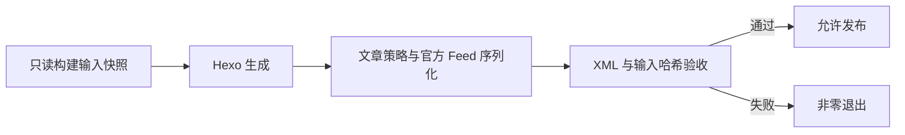

# RSS 实施与运行记录

2026-10-11。本地功能已实现，生产未发布。

## 功能

- Atom `/atom.xml`、RSS 2.0 `/rss.xml`，最新 50 篇，按发布日期倒序。
- 草稿、未来日期、`published: false`、`feed: false`、普通页面不收录。
- 中文摘要：显式 description/intro/excerpt 优先，否则从正文提取前 200 个 Unicode 字符。Atom 使用文本摘要，RSS 使用转义后的 HTML 文本。
- URL 作为稳定 ID/GUID。显式 updated 使用 Hexo 的解析结果，缺省使用 date；无效显式值阻断构建。Atom 源级 updated 使用收录条目的最大更新时间。
- 订阅页 `/subscribe/`、导航、RSS 图标和双格式自动发现；关闭配置后隐藏入口及发现标签。



## 命令与文件

```bash
npm ci
npm run test:feed
npm run build:verified
npm run verify:feed
```

Node 要求 >=20.19.0。npm 为本次安装入口，npm 机械同步了 package-lock 和 yarn.lock；部署时使用 npm ci，避免混用安装工具。

`scripts/feed-policy.js` 是 Hexo 插件。`lib/` 放可测试策略和快照代码；`tools/` 放构建、验证和上传工具，避免 Hexo 将命令行工具当插件加载。

构建限定并发 4 并启用 bail。改动前默认无限并发完整构建在 4GB 堆上 OOM，限制并发后完整构建成功。标题 URL 不使用 abbrlink，因此构建工具注销该插件的源文件重写 filter，防止构建改写文章。原有文章 URL 与全站时区配置保留。

`.rss-build/manifest.json` 为忽略的本地验收产物，保存预期条目、Feed 路径与构建输入集合的 SHA-256；新增、修改或删除源文件后必须重建，旧验收不可复用。验证脚本结构化解析 XML 和 HTML，检查双格式集合、日期、ID、摘要、入口及自动发现。

锁定插件 4.0.0 与 feedsmith 2.9.0 的实际接口存在兼容差异，适配层以结构化解析/序列化修复 RSS GUID，并修正 Atom 源级更新时间，不修改 node_modules。

## 发布

线上 HTTP 响应确认当前域名来自 Vercel，实施前 atom.xml/rss.xml 均为 404。Vercel CLI 读取项目时返回 missing authentication token，所以本次未部署、未修改远端服务器、未提交或推送。

Vercel 的 `vercel-build` 接入 `build:verified`，两个 XML 路由设置对应 MIME 与 300 秒缓存。发布后仍需实际 GET 两个地址，验证 HTTP 200、XML 类型、最新条目和阅读器导入；本地成功不是上线证据。

Nginx 兼容脚本 `deploy.sh`、`auto-deploy.sh` 接入相同门禁。`tools/upload-public.sh` 再次验证本地快照，并逐个 XML 先上传临时文件再 rename。两种 XML 不构成跨文件事务。禁用或变更路径时，Nginx 默认保留旧远端源供已有读者访问；不宣称远端旧地址立即关闭，若要删除须另行指定地址。Vercel 新部署仅包含当前产物。

`auto-deploy.sh` 仍保留原有全量暂存/提交/推送行为，不建议用于本次发布。推荐 Vercel 正常部署流程，或单独调用 deploy.sh；只暂存 RSS 相关文件。

## 验收范围

策略及验证测试覆盖：过滤边界、超过 50 篇、稳定更新时间、空集合、启停切换、路径更改、中文/特殊字符与摘要安全、XML 错误、重复 ID、自动发现、源文件删除和保留 mtime 的修改。

本次验证结果：12/12 测试通过；`npm run build:verified` 通过，日志没有脚本加载错误；Atom/RSS 各 50 条；再次完整构建后解析出的条目、ID 和时间一致；本地 HTTP GET 两个源与构建产物逐字节相同；1440x900 桌面和 390x844 移动端截图显示导航与地址正常。`git diff --check` 和三个部署脚本语法检查通过。

本地预览：`http://127.0.0.1:4173/subscribe/`。截图位于忽略的 `output/playwright/rss-desktop.png`、`output/playwright/rss-mobile.png`。本地静态预览不运行写文章的发布 API。实际第三方阅读器导入、线上响应及生产回滚演练尚未执行。

回滚使用上一份已验收静态产物；已有订阅者时保持源 URL 或旧 XML。源码只撤回 RSS 相关文件，不撤回期间新增文章。
