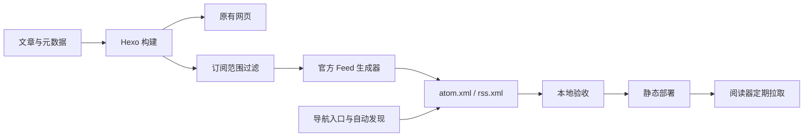

# RSS 订阅实施方案

日期：2026-10-11。状态：本地实施与独立复核完成；线上尚未部署。实际文件与验证记录见 `docs/rss-implementation.md`，以下保留设计方案。

## 1. 目标与边界

为博客提供稳定、可发现、可被常见阅读器订阅的更新源：

- Atom 1.0：`https://www.daoyuly.cn/atom.xml`，作为默认入口。
- RSS 2.0：`https://www.daoyuly.cn/rss.xml`，作为兼容入口。
- 首期只订阅文章，不包含专题聚合页、论文列表页、编辑器和其他普通页面。
- 最近 50 篇，按发布日期倒序；输出摘要和原文链接。
- 不增加账号、邮箱收集、邮件推送、数据库、浏览器通知或付费订阅。
- 不按专题拆分 Feed；后续有明确需求时再扩展，保留首期地址。



## 2. 当前事实

- `package.json` 使用 Hexo 7，未安装 `hexo-generator-feed`；本地未生成订阅源。
- `_config.yml` 的站点地址为 `https://www.daoyuly.cn`，文章路径为 `:year/:title/`。
- `themes/yilia/_config.yml` 的 `rss` 和 `subnav.rss` 均被注释。
- `themes/yilia/layout/_partial/head.ejs` 已有 Atom 自动发现模板，但 `rel="alternative"` 拼写错误，应为 `alternate`。
- 主题 `theme-menu.ejs` 共用菜单配置生成多个导航位置，可以复用现有导航增加入口。
- `render_drafts: false`；`future: true`，因此不能假设未来日期文章自动排除。
- `timezone: ''`，日期解析依赖运行环境；`use_date_for_updated: false`，需检查缺少显式更新时间的生成结果。
- Vercel 是静态构建；服务器脚本也上传 `public/`，Feed 不需要 Express API。
- 同时存在 npm 和 Yarn 锁文件，现有构建脚本使用 npm；实施时确定实际安装工具，避免混用造成依赖漂移。
- 发布脚本未可靠阻断构建失败；`auto-deploy.sh` 还会暂存所有变更，不能直接当作 RSS 验收流程。

以上为仓库静态事实，尚未验证实际线上部署路径和响应头。

## 3. 依赖与配置

使用 Hexo 官方 `hexo-generator-feed`，不手写 XML。

2026-10-11 查询 npm：最新版本为 4.0.0，要求 Node >=20.19.0；当前本地 Node 为 24.11.1。官方 README 的历史兼容说明并不足以单独证明 4.0.0 在本项目 Hexo 7 上可用，必须用实际锁定版本构建验证。先核对服务器或 Vercel 的构建 Node；若不满足要求，选择兼容版本并重新核对其实现，不能直接安装浮动 latest。

在构建环境满足要求且项目兼容验证通过时，使用：

```bash
npm install --save-exact hexo-generator-feed@4.0.0
```

根 `_config.yml` 增加：

```yaml
feed:
  enable: true
  type:
    - atom
    - rss2
  path:
    - atom.xml
    - rss.xml
  limit: 50
  content: false
  content_limit: 200
  content_limit_delim: ''
  order_by: -date
  autodiscovery: false
```

由主题统一维护自动发现，避免插件和主题重复插入标签。中文摘要不使用空格作为截断分隔符。200 字符只是插件回退摘要长度，不是所有文章摘要的硬上限：显式 description、intro、excerpt 可能优先于它。

## 4. 内容与时间契约

| 项目 | 首期规则 |
| --- | --- |
| 纳入范围 | 已发布文章，包含论文研读文章和随想 |
| 排除范围 | 草稿、未来日期文章、普通页面、显式 `feed: false` 的文章 |
| 数量与排序 | 过滤后取最新 50 篇，按 `date` 倒序 |
| 摘要 | 优先显式文章摘要；缺省使用插件回退摘要 |
| 正文 | 不输出全文；保留原文链接 |
| 身份 | Atom id / RSS guid 使用规范文章 URL；不修改既有 permalink |
| 日期 | published 使用发布日期；updated 使用明确更新时间或稳定回退值 |

`feed: false` 是本方案拟新增的站点约定，并非已确认的官方插件功能。核对到的官方 master 生成器过滤草稿，但没有上述未来日期和自定义排除逻辑。实施时以安装包源码为准。

新增小型 `scripts/feed-policy.js` 适配层，只向 Atom/RSS 生成器传入过滤后的文章集合，复用官方序列化。先验证 Hexo 7 的生成器注册、读取及脚本加载顺序，再确定包装方式；不要直接修改依赖文件，也不要全局删改 `locals.posts`。过滤发生在数量截断之前，其他页面和 `scripts/papers.js` 不受影响。

边界测试应覆盖发布日期等于构建时刻、未来日期、草稿、`feed: false` 和全部被排除的空集合。空集合必须保留可解析的空 Feed；若锁定插件默认不生成文件，A 包需实现复用其结构化序列化依赖的空集合分支，并明确声明直接使用的依赖。该分支通过之前 A 包不能验收，不能让旧 XML 被继续发布。

更新时间规则在 Feed 副本内实现：通过结构化 front-matter 解析确认显式 `updated`，有效时使用该值，没有时回退 `date`，无效值使验证失败。禁止直接使用可能来自文件 mtime 的默认更新时间，禁止改写 Hexo 全局文章模型。原始 front-matter 的读取或解析复用项目已有能力；必要时明确增加直接依赖。

暂不修改全站 `future` 或 `timezone`。先对比本地和生产构建环境的日期解析；Feed 时间若不一致，应明确修复范围后处理，避免顺带改变历史文章路径。

本项目包含 Mermaid 和交互内容，摘要模式能减少阅读器渲染问题。对中文、代码、图片、HTML 和图表文章检查摘要；若自动截断产生不可用 HTML，再增加 Feed 专用的纯文本摘要处理。图片和正文内资源是否绝对地址需按生成结果验证，不能从文章链接正确推断资源链接也正确。

## 5. 读者入口与自动发现

- 主题菜单增加“RSS 订阅”，链接 `/subscribe/`，覆盖桌面和移动导航。
- `subnav.rss: /atom.xml`，复用已有 RSS 图标；`rss: /atom.xml` 保留主题配置兼容。
- 新增 `source/subscribe/index.md`，展示 Atom 与 RSS 2.0 的完整地址及链接，使用已有页面布局。提供简短订阅说明，不引入外部阅读器追踪或订阅者统计。
- 修改 `head.ejs`：使用 `rel="alternate"`，分别声明 Atom 的 `application/atom+xml` 和 RSS 的 `application/rss+xml`。URL 使用 Hexo URL helper。
- 发现标签跟随 `feed.enable` 与配置路径，关闭 Feed 时入口和标签应同步关闭，避免失效链接。
- 若修改 RSS 图标模板，补充“RSS 订阅”可访问名称和悬停提示；不要求重建整套主题资源。

## 6. 文件范围与工作包

| 工作包 | 文件 / 责任 | 完成条件 |
| --- | --- | --- |
| A：生成与策略 | `package.json`、实际使用的锁文件、`_config.yml`、`scripts/feed-policy.js` | 两种 XML 生成，范围与时间契约满足 |
| B：订阅入口 | 主题配置、`head.ejs`、必要时 `left-col.ejs`、`source/subscribe/index.md` | 桌面/移动可订阅，自动发现无重复 |
| C：自动验收 | `scripts/verify-feed.js`、必要的验证依赖、package 验证命令 | XML 和策略错误使验证进程非零退出 |
| D：部署验收 | `package.json` 的发布构建命令、实际使用的上传脚本、发布文档及部署操作 | 真实发布路径接入门禁，线上 XML 与本地一致 |

每个工作包完成后报告改动和证据，等待验收再进入下一包。实现后由独立 reviewer/verifier 复核；不能用作者自检代替验收。

保留现有无关变更，只逐项暂存本工作包文件。不要运行会全量暂存并推送的 `auto-deploy.sh`。

## 7. 验证计划

新增验证脚本使用结构化 XML 解析器；不得通过正则或字符串包含判断 XML 正确。XML 解析依赖归入开发依赖；验证脚本读取生成产物和构建时预期文章清单。

自动检查：

1. `public/atom.xml`、`public/rss.xml` 存在，根节点和命名空间符合对应格式。
2. 两种格式条目一致，数量不超过 50；与过滤后的预期集合一致，最新文章未遗漏。
3. 标题、摘要中的中文和 XML 特殊字符正确；标题和绝对 HTTPS 原文地址有效。
4. Atom id / RSS guid 唯一且稳定，发布日期有效、排序正确，排除规则全部生效。
5. 重复构建不产生新增文章身份；未修改文章的条目更新时间不因构建或 checkout 任意漂移。无需强制 Feed 级构建时间或整个文件逐字节不变。
6. 代表性 HTML 页面恰有两种自动发现标签，路径与 MIME 类型对应；订阅页面和 RSS 图标链接有效。
7. 隔离 fixture 覆盖超过 50 篇、未来/草稿/排除文章、空集合和特殊字符；不向真实文章目录写测试文章。

实施后本地命令约定：

```bash
npm run build && npm run verify:feed
git diff --check
```

先记录原有构建问题，构建失败或 Feed 验证失败均阻断发布，不能将旧 public 目录当作成功构建证据。首次构建应隔离或清除旧 Feed 产物，避免缓存掩盖失败；不在未经评估时清除整个工作目录。

人工检查桌面与移动导航，并至少在一个实际阅读器中完成：添加订阅、读取中文摘要、打开原文、重新拉取无重复。

## 8. 部署与线上验收

实施前确认真实生产走 Nginx 上传还是 Vercel。两条路径都只是发布静态产物，无需修改 `server/index.js`。

统一增加 `build:verified` 命令，执行 `npm run build && npm run verify:feed`。`vercel-build` 改为调用该命令；实际使用的 Nginx 上传脚本也必须调用它，并在失败时立即退出，只有成功后才执行上传。若两个上传脚本都继续作为受支持入口，两个都接入门禁。发布脚本修改仅限门禁与必要的退出行为；当前全量暂存风险通过不使用 `auto-deploy.sh` 执行本任务来规避，不顺带重构提交策略。

- 发布前保存现有线上订阅源和受影响页面（如果存在），记录 Git revision、Node 版本、构建结果、Feed 条目数量与 SHA-256。
- 仅在本地门禁通过后使用实际部署路径；服务器 Feed 文件优先通过临时文件上传后 rename 发布，避免读到半写入 XML。
- 线上 GET `/atom.xml`、`/rss.xml` 返回 200 和 XML 内容，不能是首页回退 HTML；检查标题、最新文章和条目集合。
- 响应类型优先分别设置为 `application/atom+xml` 和 `application/rss+xml`；`application/xml` 可作为兼容结果记录，不接受 `text/html`。
- 检查真实 Nginx/CDN/Vercel 缓存策略。建议 Feed 缓存 5 分钟，并有 ETag 或 Last-Modified；确认实际配置后再修改，避免盲改全站缓存。
- 无跨域浏览器消费需求时不增加 CORS；不依赖服务器推送，阅读器更新速度受拉取周期影响。
- 刷新缓存后对比本地和线上 Feed 内容，并在阅读器确认可拉取。只有这些证据齐全才称为上线完成。

## 9. 回滚与验收结论

部署前出现故障：保持线上版本，修复后重跑门禁。部署后出现故障：恢复上一份已验收静态产物；Feed 已有订阅者时优先保留地址和上一份可用 XML，避免直接删除订阅源。

源码回滚仅撤回 RSS 工作包的配置、依赖、脚本和模板变更；不撤回期间发布的新文章和无关改动。回滚后再验证页面入口和 Feed 状态，不仅报告 commit 号。

首期验收需要：双格式可解析、范围准确、条目身份稳定、入口可用、构建失败可阻断发布、线上真实可拉取。专题源、全文源和邮件订阅都留作后续独立工作包。

## 10. 官方依据

- 配置与摘要优先级：https://github.com/hexojs/hexo-generator-feed
- 当前发布包元数据：https://registry.npmjs.org/hexo-generator-feed/latest
- 上游生成器实现：https://github.com/hexojs/hexo-generator-feed/blob/master/lib/generator.js

上游 master 可变化；实施必须核对锁定的实际安装版本，再据此修订适配层和验证规则。
