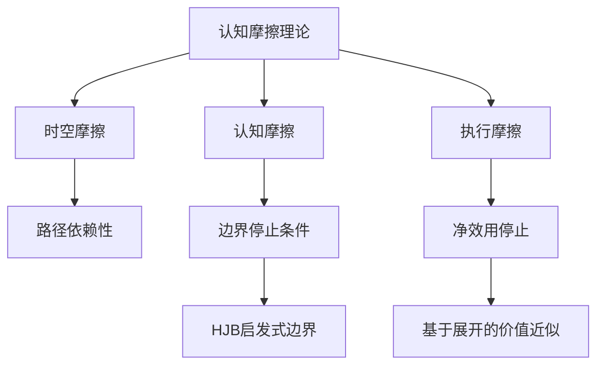
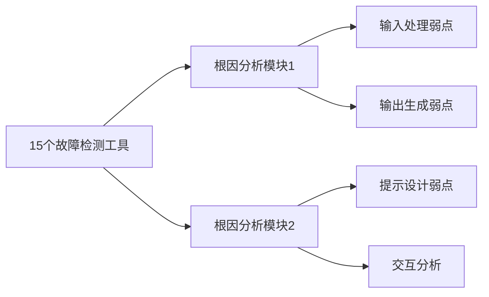
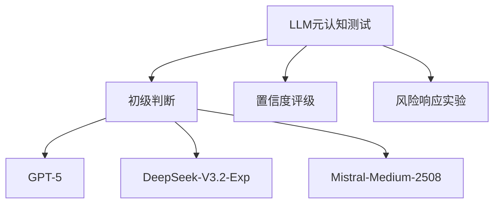
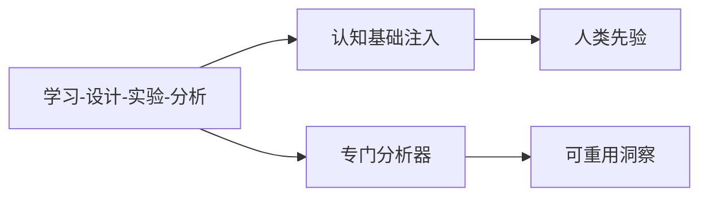

## 📊 每日概览

今日 ArXiv cs.AI 领域共收录25篇论文，其中多篇聚焦于AI Agent技术的核心挑战与创新突破。本报告重点分析agent相关的最新研究趋势，涵盖认知架构、安全性保障、应用场景等多个维度。

---

## 🔍 核心趋势分析

### 1️⃣ 认知架构的物理化与认知摩擦

**代表论文**：《The Triadic Cognitive Architecture: Bounding Autonomous Action via Spatio-Temporal and Epistemic Friction》

#### 突破性观点
- **认知摩擦**：首次提出将机器推理建立在连续时间物理基础上的统一数学框架
- **三重约束**：非线性滤波理论 × 黎曼路由几何 × 最优控制
- **动态决策**：将代理的思考过程映射为耦合的随机控制问题，信息获取具有路径依赖性和物理约束

#### 技术创新


#### 实验验证
在模拟急诊诊断网格（EMDG）中验证显示：
- 贪心基线在延迟和拥塞成本下过度思考
- 三重策略减少了行动时间，同时改善患者生存率，且不降低诊断准确性

---

### 2️⃣ 多智能体系统的奖励破解防御

**代表论文**：《Extending MONA in Camera Dropbox: Reproduction, Learned Approval, and Design Implications for Reward-Hacking Mitigation》

#### MONA框架演进
- **核心理念**：通过限制代理的规划范围，同时提供远见批准作为训练信号
- **关键创新**：将批准方法谱系从oracle、noisy、misspecified到learned、calibrated

#### 重要发现
```python
# 学习批准模型的性能对比
approval_methods = {
    "Oracle MONA": {"hacking_rate": 0.0%, "intended_behavior": 99.9%},
    "Calibrated Learned-Overseer": {"hacking_rate": 0.0%, "intended_behavior": 11.9%}
}
```

**工程启示**：主要挑战从证明MONA概念转向构建学习批准模型，在保持充分远见的同时避免重新打开奖励破解通道

---

### 3️⃣ 结构化意图协议的跨模型鲁棒性

**代表论文**：《Structured Intent as a Protocol-Like Communication Layer: Cross-Model Robustness, Framework Comparison, and the Weak-Model Compensation Effect》

#### 协议化通信层
- **5W3H框架**：What, Why, When, Where, Who, How, How much
- **跨模型测试**：Claude、GPT-4o、Gemini 2.5 Pro
- **多语言支持**：中文、英文、日文

#### 实验结果
| 模型 | 跨语言得分方差 | 目标对齐得分提升 |
|------|---------------|----------------|
| Gemini | 0.470 → 0.020 | +1.006 |
| GPT-4o | 0.470 → 0.020 | +0.523 |
| Claude | 0.470 → 0.020 | +0.217 |

#### 用户研究价值
- 交互回合减少60%
- 用户满意度从3.16提升至4.04
- 验证了结构化意图表示作为人类-AI交互的稳健通信层的实践价值

---

### 4️⃣ Agent可靠性与故障诊断

**代表论文**：《AgentFixer: From Failure Detection to Fix Recommendations in LLM Agentic Systems》

#### 全面的验证框架


#### IBM CUGA实际应用
- **基准测试**：AppWorld和WebArena
- **发现的问题**：计划器不对齐、模式违规、脆弱提示依赖
- **性能提升**：中型模型（Llama 4、Mistral Medium）显著缩小与前沿模型的差距

---

### 5️⃣ 多模态代理工具规划评估

**代表论文**：《ATP-Bench: Towards Agentic Tool Planning for MLLM Interleaved Generation》

#### ATP-Bench基准
- **数据规模**：7,702个问答对（包括1,592个VQA对）
- **8个类别**：25个视觉关键意图
- **评估机制**：多代理大模型作为裁判（MAM系统）

#### 关键发现
```markdown
### 工具调用行为分析
1. **连贯性挑战**：模型在交错规划中挣扎
2. **性能差异**：不同模型的工具使用行为显著变化
3. **改进空间**：存在 substantial room for improvement
```

---

### 6️⃣ 工业级多智能体诊断系统

**代表论文**：《CausalPulse: An Industrial-Grade Neurosymbolic Multi-Agent Copilot for Causal Diagnostics in Smart Manufacturing》

#### 生产级部署
- **实施地点**：Robert Bosch制造工厂
- **实时性能**：端到端延迟50-60秒，接近线性扩展（R²=0.97）
- **成功率**：98.0%（公共数据集）和98.73%（专有数据集）

#### 模块化设计优势
- 计划和工具使用：98.75%
- 自我反思：97.3%
- 协作：99.2%

---

### 7️⃣ AI元认知能力的测量框架

**代表论文**：《Measuring the metacognition of AI》

#### 元认知评估方法
- **meta-d'框架**：评估元认知敏感性的黄金标准
- **信号检测理论**：测量AI根据不确定性和风险自发调节决策的能力

#### 实验设计


---

### 8️⃣ AI驱动AI的研发范式

**代表论文**：《ASI-Evolve: AI Accelerates AI》

#### 研究循环设计


#### 重大成果
- **神经网络架构**：发现105个SOTA线性注意力架构，最佳模型超越DeltaNet +0.97
- **预训练数据**：平均基准性能提升+3.96，MMLU上提升超过18分
- **强化学习算法**：在AMC32、AIME24、OlympiadBench上超越GRPO

---

## 🏭 应用场景拓展

### 医疗领域
- **Symphony for Medical Coding**：可扩展和可解释的医疗编码系统
- **CausalPulse**：智能制造中的因果诊断

### 科学研究
- **Owl-AuraID 1.0**：自主科学仪器和数据分析系统
- **Reinforced Reasoning**：端到端逆向合成规划

### 交通运输
- **C-TRAIL**：基于常识世界框架的轨迹规划

---

## 📈 技术发展预测

### 近期趋势
1. **认知架构物理化**：更多研究将考虑物理约束和时空因素
2. **元认知能力增强**：AI系统的自我调节和置信度评估
3. **模块化设计标准化**：代理组件的接口和协议标准化

### 挑战与机遇
- **安全性**：奖励破解和代理对齐问题
- **可解释性**：复杂代理系统的透明度
- **效率**：长时程任务的计算成本控制

---

## 🔬 关键技术创新点

### 1. 认知摩擦理论
- **创新性**：首次将认知推理建立在连续时间物理基础
- **实用性**：解决了代理在交互环境中的失败模式

### 2. 学习批准机制
- **突破点**：从启发式批准转向数据驱动的批准模型
- **应用价值**：在保持安全性的同时提升代理性能

### 3. 协议化意图表示
- **架构设计**：结构化通信层提升跨模型鲁棒性
- **用户体验**：减少交互回合，提高满意度

### 4. 诊断修复框架
- **系统化方法**：全面的故障检测和根因分析
- **工业应用**：生产环境的可靠性和可维护性

---

## 💡 研究启示

### 对AI开发者
1. **关注认知边界**：在设计中考虑物理和认知约束
2. **重视协议化通信**：结构化表示提升系统鲁棒性
3. **实施模块化设计**：便于维护和扩展的架构

### 对研究人员
1. **跨学科融合**：认知科学、控制理论、机器学习的结合
2. **实用主义导向**：理论研究与实际应用并重
3. **安全第一原则**：在功能实现的同时确保安全性

---

## 📚 参考资料

1. The Triadic Cognitive Architecture: Bounding Autonomous Action via Spatio-Temporal and Epistemic Friction
2. Extending MONA in Camera Dropbox: Reproduction, Learned Approval, and Design Implications for Reward-Hacking Mitigation
3. Structured Intent as a Protocol-Like Communication Layer: Cross-Model Robustness, Framework Comparison, and the Weak-Model Compensation Effect
4. AgentFixer: From Failure Detection to Fix Recommendations in LLM Agentic Systems
5. ATP-Bench: Towards Agentic Tool Planning for MLLM Interleaved Generation
6. CausalPulse: An Industrial-Grade Neurosymbolic Multi-Agent Copilot for Causal Diagnostics in Smart Manufacturing
7. ASI-Evolve: AI Accelerates AI

---

*生成时间：2026年4月1日*  
*数据来源：https://papers.cool/arxiv/cs.AI*  
*分析方法：基于标题、摘要和关键词的深度技术趋势分析*