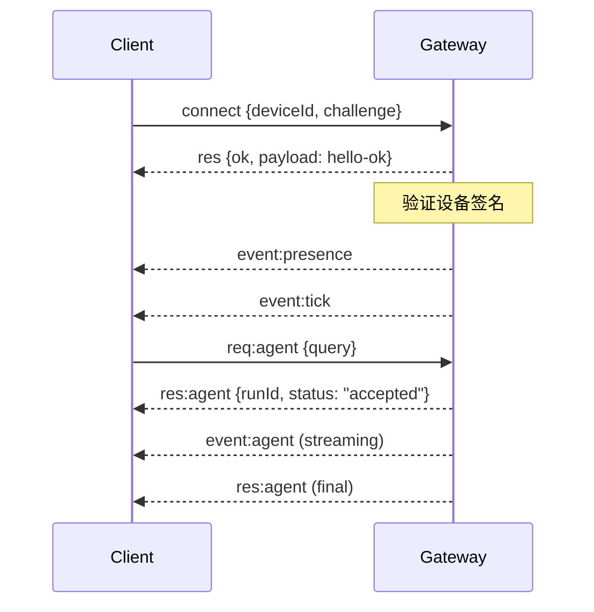

# OpenClaw 架构深度解析：插件、Skills、Channels 与扩展机制的完整技术分析

> OpenClaw 是一个设计精良的个人 AI Agent 运行时平台，其模块化架构涵盖了 Gateway 网关、多渠道 Channel、Skills 技能系统、Plugins 插件机制以及 Hooks 事件驱动等核心组件。本文从架构设计到工程实现进行全面剖析。

## 一、OpenClaw 整体架构

### 1.1 架构概览

```
┌─────────────────────────────────────────────────────────────────────────────┐
│                           OpenClaw 完整架构                                  │
└─────────────────────────────────────────────────────────────────────────────┘

                         ┌──────────────────────┐
                         │   Control Clients    │
                         │  (macOS App / CLI /  │
                         │    Web Admin)        │
                         └──────────┬───────────┘
                                    │ WebSocket
                                    ▼
┌─────────────────────────────────────────────────────────────────────────────┐
│                              Gateway (核心网关)                              │
│  ┌─────────────────────────────────────────────────────────────────────┐   │
│  │                         WebSocket Server                            │   │
│  │                    (协议: JSON over WebSocket)                       │   │
│  └─────────────────────────────────────────────────────────────────────┘   │
│                                                                             │
│  ┌───────────┐ ┌───────────┐ ┌───────────┐ ┌───────────┐ ┌───────────┐   │
│  │  Session  │ │   Agent   │ │  Memory   │ │   Tool    │ │   Hook    │   │
│  │  Manager  │ │  Runtime  │ │  System   │ │  Router   │ │  Engine   │   │
│  └───────────┘ └───────────┘ └───────────┘ └───────────┘ └───────────┘   │
│                                                                             │
│  ┌─────────────────────────────────────────────────────────────────────┐   │
│  │                      Channel Layer (消息渠道层)                      │   │
│  │  ┌─────────┐ ┌─────────┐ ┌─────────┐ ┌─────────┐ ┌─────────┐      │   │
│  │  │WhatsApp │ │Telegram │ │ Discord │ │ Signal  │ │ iMessage │      │   │
│  │  │ (Baileys)│ │(grammY) │ │(discord)│ │(signal) │ │(BlueBubbles)│   │   │
│  │  └─────────┘ └─────────┘ └─────────┘ └─────────┘ └─────────┘      │   │
│  │  ┌─────────┐ ┌─────────┐ ┌─────────┐ ┌─────────┐ ┌─────────┐      │   │
│  │  │  Slack  │ │  Feishu │ │  IRC    │ │ Matrix  │ │  More   │      │   │
│  │  │ (Bolt)  │ │ (WS)    │ │  (IRC)  │ │(plugin) │ │(plugins)│      │   │
│  │  └─────────┘ └─────────┘ └─────────┘ └─────────┘ └─────────┘      │   │
│  └─────────────────────────────────────────────────────────────────────┘   │
│                                                                             │
│  ┌─────────────────────────────────────────────────────────────────────┐   │
│  │                     Plugin System (插件系统)                         │   │
│  │  ┌───────────────┐ ┌───────────────┐ ┌───────────────┐             │   │
│  │  │  Memory Core  │ │ Memory LanceDB│ │  Voice Call   │  ...        │   │
│  │  └───────────────┘ └───────────────┘ └───────────────┘             │   │
│  └─────────────────────────────────────────────────────────────────────┘   │
│                                                                             │
│  ┌─────────────────────────────────────────────────────────────────────┐   │
│  │                     Skills System (技能系统)                         │   │
│  │  ┌─────────────┐ ┌─────────────┐ ┌─────────────┐ ┌─────────────┐   │   │
│  │  │  weather    │ │  nano-pdf   │ │ blog-publisher│ │   github   │   │   │
│  │  └─────────────┘ └─────────────┘ └─────────────┘ └─────────────┘   │   │
│  └─────────────────────────────────────────────────────────────────────┘   │
└─────────────────────────────────────────────────────────────────────────────┘
                                    │
                                    ▼
                         ┌──────────────────────┐
                         │      Model Layer     │
                         │  (OpenAI / Anthropic │
                         │   / Gemini / etc.)   │
                         └──────────────────────┘
```

### 1.2 核心设计原则

| 原则 | 说明 |
|------|------|
| **单 Gateway 实例** | 每个主机运行唯一的 Gateway，统一管理所有消息渠道 |
| **WebSocket 通信** | 客户端和控制面通过 WebSocket 进行双向通信 |
| **模块化扩展** | Skills、Plugins、Hooks 各司其职，松耦合设计 |
| **会话隔离** | DM 消息共享主会话，群组消息独立隔离 |
| **安全优先** | 配对认证、权限控制、沙箱执行 |

### 1.3 核心组件职责

```typescript
// 组件职责映射
interface OpenClawComponents {
  gateway: {
    role: "核心网关进程";
    responsibilities: [
      "WebSocket 服务器",
      "渠道连接管理",
      "会话状态持久化",
      "Agent 调度",
      "工具路由",
    ];
  };
  
  channels: {
    role: "消息渠道适配器";
    responsibilities: [
      "协议转换",
      "消息收发",
      "媒体处理",
      "群组管理",
    ];
  };
  
  plugins: {
    role: "功能扩展模块";
    responsibilities: [
      "注册新渠道",
      "添加工具",
      "扩展 RPC 方法",
      "提供后台服务",
    ];
  };
  
  skills: {
    role: "技能指导系统";
    responsibilities: [
      "指导 Agent 使用工具",
      "提供任务模板",
      "环境依赖管理",
    ];
  };
  
  hooks: {
    role: "事件驱动自动化";
    responsibilities: [
      "命令响应",
      "生命周期钩子",
      "消息审计",
    ];
  };
}
```

## 二、Gateway 网关架构

### 2.1 WebSocket 协议

OpenClaw 使用 JSON over WebSocket 进行通信：

```typescript
// 连接握手
interface ConnectMessage {
  type: "connect";
  deviceId: string;
  challenge: string;        // 签名挑战
  role: "client" | "node";
  caps?: string[];          // Node 能力声明
}

// 请求-响应模式
interface RequestMessage {
  type: "req";
  id: string;
  method: string;           // health, status, send, agent
  params: any;
}

interface ResponseMessage {
  type: "res";
  id: string;
  ok: boolean;
  payload?: any;
  error?: string;
}

// 服务器推送事件
interface EventMessage {
  type: "event";
  event: string;            // agent, chat, presence, health
  payload: any;
  seq?: number;
}
```

### 2.2 连接生命周期



### 2.3 配对与安全

```typescript
// 设备配对流程
class DevicePairing {
  async handleConnect(message: ConnectMessage): Promise<ConnectResult> {
    // 1. 验证签名
    const isValid = await this.verifySignature(
      message.challenge,
      message.deviceId
    );
    
    if (!isValid) {
      throw new Error("Invalid signature");
    }
    
    // 2. 检查配对状态
    const isPaired = await this.checkPairingStatus(message.deviceId);
    
    if (!isPaired) {
      // 3. 本地连接可自动批准
      if (this.isLocalConnection()) {
        await this.approveDevice(message.deviceId);
      } else {
        // 4. 远程连接需要显式批准
        return { requiresApproval: true };
      }
    }
    
    // 5. 颁发设备令牌
    const token = await this.issueDeviceToken(message.deviceId);
    
    return { ok: true, token };
  }
}
```

## 三、Channel 通道机制

### 3.1 支持的渠道

OpenClaw 支持 **20+ 消息渠道**：

| 渠道 | 实现方式 | 配置路径 | 插件 |
|------|---------|---------|------|
| WhatsApp | Baileys | `channels.whatsapp` | 内置 |
| Telegram | grammY | `channels.telegram` | 内置 |
| Discord | discord.js | `channels.discord` | 内置 |
| Signal | signal-cli | `channels.signal` | 内置 |
| iMessage | BlueBubbles | `channels.bluebubbles` | 内置 |
| Slack | Bolt SDK | `channels.slack` | 内置 |
| Feishu | WebSocket | `channels.feishu` | 插件 |
| Matrix | Matrix SDK | `channels.matrix` | 插件 |
| IRC | IRC Client | `channels.irc` | 内置 |
| MS Teams | Bot Framework | `channels.msteams` | 插件 |

### 3.2 Channel 适配器接口

```typescript
// Channel 插件接口
interface ChannelPlugin {
  // 元数据
  id: string;
  meta: {
    id: string;
    label: string;
    selectionLabel: string;
    docsPath: string;
    blurb: string;
    aliases?: string[];
    preferOver?: string[];
  };
  
  // 能力声明
  capabilities: {
    chatTypes: ("direct" | "group" | "channel")[];
    media?: {
      images?: boolean;
      audio?: boolean;
      documents?: boolean;
    };
    threads?: boolean;
    reactions?: boolean;
  };
  
  // 配置解析
  config: {
    listAccountIds: (cfg: Config) => string[];
    resolveAccount: (cfg: Config, accountId?: string) => AccountConfig;
  };
  
  // 消息发送
  outbound: {
    deliveryMode: "direct" | "queue";
    sendText: (ctx: SendContext) => Promise<SendResult>;
    sendMedia?: (ctx: MediaSendContext) => Promise<SendResult>;
  };
  
  // 可选组件
  setup?: SetupWizard;
  security?: SecurityPolicy;
  status?: HealthChecker;
  gateway?: GatewayManager;
  mentions?: MentionHandler;
  threading?: ThreadingHandler;
  streaming?: StreamingHandler;
  actions?: MessageActionHandler;
  commands?: NativeCommandHandler;
}
```

### 3.3 Channel 路由机制

```typescript
// 消息路由流程
class ChannelRouter {
  async routeInbound(message: InboundMessage): Promise<RoutingResult> {
    // 1. 确定目标 Agent
    const agentId = await this.resolveAgent(message);
    
    // 2. 确定会话键
    const sessionKey = this.resolveSessionKey(message, agentId);
    
    // 3. 检查权限
    const authResult = await this.checkAuthorization(message);
    
    if (!authResult.allowed) {
      return { action: "reject", reason: authResult.reason };
    }
    
    // 4. 投递到 Agent
    return {
      action: "deliver",
      agentId,
      sessionKey,
      context: this.buildContext(message)
    };
  }
  
  resolveSessionKey(message: InboundMessage, agentId: string): string {
    const { dmScope } = this.config.session;
    
    switch (dmScope) {
      case "main":
        // 所有 DM 共享主会话
        return `agent:${agentId}:main`;
        
      case "per-peer":
        // 按发送者隔离
        return `agent:${agentId}:dm:${message.senderId}`;
        
      case "per-channel-peer":
        // 按渠道+发送者隔离
        return `agent:${agentId}:${message.channel}:dm:${message.senderId}`;
        
      case "per-account-channel-peer":
        // 按账号+渠道+发送者隔离（推荐用于多账号）
        return `agent:${agentId}:${message.channel}:${message.accountId}:dm:${message.senderId}`;
        
      default:
        return `agent:${agentId}:main`;
    }
  }
}
```

### 3.4 多账号支持

```typescript
// WhatsApp 多账号配置示例
const config = {
  channels: {
    whatsapp: {
      accounts: {
        personal: {
          authDir: "~/.openclaw/credentials/whatsapp/personal",
          dmPolicy: "pairing",
        },
        biz: {
          authDir: "~/.openclaw/credentials/whatsapp/biz",
          dmPolicy: "allowlist",
          allowFrom: ["+15551234567"],
        },
      },
    },
  },
  
  // 绑定路由
  bindings: [
    { 
      agentId: "home", 
      match: { channel: "whatsapp", accountId: "personal" } 
    },
    { 
      agentId: "work", 
      match: { channel: "whatsapp", accountId: "biz" } 
    },
  ],
};
```

## 四、Plugin 插件系统

### 4.1 插件架构

```typescript
// 插件发现流程
class PluginDiscovery {
  // 发现顺序（优先级从高到低）
  discoveryOrder = [
    "config-paths",      // plugins.load.paths
    "workspace-extensions", // <workspace>/.openclaw/extensions/
    "global-extensions", // ~/.openclaw/extensions/
    "bundled-extensions", // <openclaw>/extensions/
  ];
  
  async discoverPlugins(): Promise<Plugin[]> {
    const plugins: Plugin[] = [];
    
    // 1. 扫描配置路径
    for (const path of this.config.plugins.load.paths) {
      const plugin = await this.loadPlugin(path);
      if (plugin) plugins.push(plugin);
    }
    
    // 2. 扫描工作区扩展
    const workspacePlugins = await this.scanDirectory(
      path.join(this.workspace, ".openclaw/extensions")
    );
    plugins.push(...workspacePlugins);
    
    // 3. 扫描全局扩展
    const globalPlugins = await this.scanDirectory(
      path.join(os.homedir(), ".openclaw/extensions")
    );
    plugins.push(...globalPlugins);
    
    // 4. 加载捆绑扩展（默认禁用）
    const bundledPlugins = await this.loadBundled();
    
    return this.dedupeById(plugins);
  }
}
```

### 4.2 插件清单

每个插件必须包含 `openclaw.plugin.json`：

```json
{
  "id": "voice-call",
  "name": "Voice Call",
  "description": "Make and receive voice calls via Twilio",
  "version": "1.0.0",
  "kind": "telephony",
  "configSchema": {
    "type": "object",
    "additionalProperties": false,
    "properties": {
      "provider": { "type": "string", "enum": ["twilio", "log"] },
      "twilio": {
        "type": "object",
        "properties": {
          "accountSid": { "type": "string" },
          "authToken": { "type": "string" },
          "from": { "type": "string" }
        }
      }
    }
  },
  "uiHints": {
    "provider": { "label": "Provider", "placeholder": "twilio" },
    "twilio.accountSid": { "label": "Account SID", "sensitive": false },
    "twilio.authToken": { "label": "Auth Token", "sensitive": true }
  },
  "channels": [],
  "providers": [],
  "skills": ["./skills/voice-call"]
}
```

### 4.3 插件 API

```typescript
// 插件注册接口
interface PluginAPI {
  // 注册 Gateway RPC 方法
  registerGatewayMethod(
    name: string,
    handler: (ctx: RPCHandler) => void
  ): void;
  
  // 注册 Agent 工具
  registerTool(tool: ToolDefinition): void;
  
  // 注册 CLI 命令
  registerCli(
    setup: (program: Command) => void,
    options: { commands: string[] }
  ): void;
  
  // 注册后台服务
  registerService(service: ServiceDefinition): void;
  
  // 注册消息渠道
  registerChannel(options: { plugin: ChannelPlugin }): void;
  
  // 注册模型提供商
  registerProvider(provider: ProviderDefinition): void;
  
  // 注册自动回复命令
  registerCommand(command: CommandDefinition): void;
  
  // 注册事件钩子
  registerHook(
    event: string,
    handler: HookHandler,
    options?: HookOptions
  ): void;
  
  // 运行时助手
  runtime: {
    tts: {
      textToSpeechTelephony(options: TTSSOptions): Promise<TTSResult>;
    };
  };
  
  // 配置访问
  config: OpenClawConfig;
  
  // 日志
  logger: Logger;
}
```

### 4.4 插件实现示例

```typescript
// Voice Call 插件实现
export default function register(api: PluginAPI) {
  // 1. 注册 Gateway RPC
  api.registerGatewayMethod("voicecall.start", async ({ params, respond }) => {
    const result = await startCall(params);
    respond(true, result);
  });
  
  api.registerGatewayMethod("voicecall.status", async ({ params, respond }) => {
    const status = await getCallStatus(params.callId);
    respond(true, status);
  });
  
  // 2. 注册 Agent 工具
  api.registerTool({
    name: "voice_call",
    description: "Make a voice call",
    parameters: {
      type: "object",
      properties: {
        to: { type: "string", description: "Phone number to call" },
        message: { type: "string", description: "Message to speak" }
      },
      required: ["to", "message"]
    },
    execute: async (params) => {
      return await makeCall(params.to, params.message);
    }
  });
  
  // 3. 注册 CLI 命令
  api.registerCli(
    ({ program }) => {
      program
        .command("voicecall")
        .description("Voice call commands")
        .command("start")
        .action(async () => {
          console.log("Starting voice call...");
        });
    },
    { commands: ["voicecall"] }
  );
  
  // 4. 注册后台服务
  api.registerService({
    id: "voice-call-monitor",
    start: () => api.logger.info("Voice call monitor started"),
    stop: () => api.logger.info("Voice call monitor stopped"),
  });
}
```

### 4.5 插件插槽

某些插件类别是互斥的，通过 `plugins.slots` 选择：

```typescript
const config = {
  plugins: {
    slots: {
      // 选择内存插件
      memory: "memory-core",  // 或 "memory-lancedb" 或 "none"
    },
  },
};

// 如果多个插件声明 kind: "memory"，只有被选中的会加载
```

## 五、Skills 技能系统

### 5.1 Skills 架构

Skills 是**教导 Agent 如何使用工具的指导文档**：

```
┌─────────────────────────────────────────────────────────────────┐
│                    Skills 加载流程                               │
└─────────────────────────────────────────────────────────────────┘

     加载位置（优先级从高到低）
     ────────────────────────────
     1. <workspace>/skills/        (工作区技能)
     2. ~/.openclaw/skills/        (管理技能)
     3. <openclaw>/skills/         (捆绑技能)
     4. skills.load.extraDirs      (额外目录)
              │
              ▼
     ┌─────────────────┐
     │  扫描 SKILL.md  │
     └────────┬────────┘
              │
              ▼
     ┌─────────────────┐
     │  解析 Frontmatter │
     └────────┬────────┘
              │
              ▼
     ┌─────────────────┐
     │  检查 Eligibility │
     │  - bins 检查      │
     │  - env 检查       │
     │  - config 检查    │
     │  - os 检查        │
     └────────┬────────┘
              │
              ▼
     ┌─────────────────┐
     │  注入 System    │
     │  Prompt (列表)  │
     └─────────────────┘
```

### 5.2 Skill 格式

```markdown
---
name: nano-pdf
description: Edit PDFs with natural-language instructions using the nano-pdf CLI.
homepage: https://docs.openclaw.ai/skills/nano-pdf
user-invocable: true
metadata:
  {
    "openclaw":
      {
        "emoji": "📄",
        "requires": { "bins": ["nano-pdf"] },
        "install":
          [
            {
              "id": "brew",
              "kind": "brew",
              "formula": "nano-pdf",
              "bins": ["nano-pdf"],
              "label": "Install nano-pdf (brew)"
            }
          ]
      }
  }
---

# nano-pdf Skill

## Overview

This skill allows you to edit PDF files using natural language instructions.

## Common Tasks

### Extract Pages

```
nano-pdf extract input.pdf 1-5 -o output.pdf
```

### Merge PDFs

```
nano-pdf merge file1.pdf file2.pdf -o merged.pdf
```

## Usage Guidelines

1. Always specify output file with `-o`
2. Use `{baseDir}` for skill-relative paths
3. Check file existence before operations
```

### 5.3 Skill 元数据字段

```typescript
interface SkillMetadata {
  // 基础字段
  name: string;
  description: string;
  homepage?: string;
  "user-invocable"?: boolean;          // 默认 true
  "disable-model-invocation"?: boolean; // 默认 false
  "command-dispatch"?: "tool";         // 直接派发到工具
  "command-tool"?: string;             // 派发的工具名
  
  // OpenClaw 特定字段
  metadata: {
    openclaw: {
      emoji?: string;
      homepage?: string;
      os?: ("darwin" | "linux" | "win32")[];
      always?: boolean;                // 跳过资格检查
      
      requires?: {
        bins?: string[];               // 必需的二进制文件
        anyBins?: string[];            // 至少一个
        env?: string[];                // 必需的环境变量
        config?: string[];             // 必需的配置路径
      };
      
      primaryEnv?: string;             // apiKey 关联的环境变量
      
      install?: InstallerSpec[];       // 安装方法
    };
  };
}

interface InstallerSpec {
  id: string;
  kind: "brew" | "node" | "go" | "uv" | "download";
  formula?: string;        // brew
  package?: string;        // node/go
  bins?: string[];         // 生成的二进制文件
  url?: string;            // download
  archive?: "tar.gz" | "tar.bz2" | "zip";
  label?: string;
}
```

### 5.4 Skill 配置覆盖

```typescript
// ~/.openclaw/openclaw.json
const config = {
  skills: {
    entries: {
      "nano-banana-pro": {
        enabled: true,
        apiKey: "GEMINI_API_KEY",     // 自动注入到 env
        env: {
          GEMINI_API_KEY: "your-key",
          CUSTOM_ENDPOINT: "https://...",
        },
        config: {
          model: "nano-pro",
        },
      },
      "weather": { enabled: true },
      "summarize": { enabled: false },  // 禁用
    },
    
    // 允许的捆绑技能
    allowBundled: ["weather", "nano-pdf"],
    
    // 额外技能目录
    load: {
      extraDirs: ["/shared/skills"],
    },
  },
};
```

### 5.5 Skills 与 Plugins 的关系

```
┌─────────────────────────────────────────────────────────────────┐
│              Skills vs Plugins 对比                             │
└─────────────────────────────────────────────────────────────────┘

┌─────────────────────────────┐  ┌─────────────────────────────┐
│          Skills             │  │          Plugins            │
├─────────────────────────────┤  ├─────────────────────────────┤
│ • 指导文档 (SKILL.md)       │  │ • 代码模块 (TypeScript)     │
│ • 声明式配置                │  │ • 命令式编程                │
│ • 工具使用指南              │  │ • 注册工具、渠道、RPC       │
│ • 环境依赖声明              │  │ • 运行时逻辑                │
│ • 自动发现加载              │  │ • 可打包为 npm              │
│ • 可通过 ClawHub 分发       │  │ • 有完整生命周期            │
├─────────────────────────────┤  ├─────────────────────────────┤
│         用例                │  │         用例                │
├─────────────────────────────┤  ├─────────────────────────────┤
│ • 使用现有工具              │  │ • 添加新渠道                │
│ • 提供任务模板              │  │ • 实现新工具                │
│ • 封装工作流                │  │ • 扩展 Gateway              │
│ • 项目特定指导              │  │ • 后台服务                  │
└─────────────────────────────┘  └─────────────────────────────┘

              ┌─────────────────────────────┐
              │        插件可以打包技能      │
              │  openclaw.plugin.json:      │
              │  { "skills": ["./skills"] } │
              └─────────────────────────────┘
```

## 六、Hooks 事件驱动系统

### 6.1 Hooks 架构

```typescript
// Hooks 事件类型
type HookEventType =
  // 命令事件
  | "command"           // 所有命令
  | "command:new"       // /new 命令
  | "command:reset"     // /reset 命令
  | "command:stop"      // /stop 命令
  // Agent 事件
  | "agent:bootstrap"   // 工作区引导前
  // Gateway 事件
  | "gateway:startup"   // Gateway 启动后
  // 消息事件
  | "message"           // 所有消息
  | "message:received"  // 接收消息
  | "message:sent";     // 发送消息
```

### 6.2 Hook 结构

```
my-hook/
├── HOOK.md          # 元数据 + 文档
└── handler.ts       # 处理器实现
```

**HOOK.md 格式**:

```markdown
---
name: session-memory
description: "Save session context to memory when /new is issued"
homepage: https://docs.openclaw.ai/automation/hooks#session-memory
metadata:
  { "openclaw": { "emoji": "💾", "events": ["command:new"] } }
---

# Session Memory Hook

Saves session context to memory when you issue `/new`.

## What It Does

1. Uses the pre-reset session entry to locate the correct transcript
2. Extracts the last 15 lines of conversation
3. Uses LLM to generate a descriptive filename slug
4. Saves session metadata to a dated memory file
```

**handler.ts 实现**:

```typescript
import type { HookHandler } from "@openclaw/types";

const handler: HookHandler = async (event) => {
  // 只处理 /new 命令
  if (event.type !== "command" || event.action !== "new") {
    return;
  }
  
  console.log(`[session-memory] Saving session: ${event.sessionKey}`);
  
  // 获取会话信息
  const { sessionEntry, sessionId, workspaceDir } = event.context;
  
  if (!sessionEntry || !workspaceDir) {
    console.log("[session-memory] Missing context, skipping");
    return;
  }
  
  // 读取最近的对话
  const recentLines = await getRecentLines(sessionEntry, 15);
  
  // 生成文件名
  const slug = await generateSlug(recentLines);
  const date = new Date().toISOString().split("T")[0];
  const filename = `${date}-${slug}.md`;
  
  // 写入内存文件
  const memoryPath = path.join(workspaceDir, "memory", filename);
  await fs.writeFile(memoryPath, formatMemory(sessionEntry, recentLines));
  
  // 通知用户
  event.messages.push(`💾 Session saved to memory/${filename}`);
};

export default handler;
```

### 6.3 内置 Hooks

| Hook | 事件 | 功能 |
|------|------|------|
| **session-memory** | `command:new` | 保存会话到记忆文件 |
| **bootstrap-extra-files** | `agent:bootstrap` | 注入额外的引导文件 |
| **command-logger** | `command` | 记录所有命令到日志 |
| **boot-md** | `gateway:startup` | 运行 BOOT.md |

### 6.4 Hook 发现与加载

```typescript
// 发现顺序
const discoveryOrder = [
  "<workspace>/hooks/",     // 工作区钩子（最高优先级）
  "~/.openclaw/hooks/",     // 管理钩子
  "<openclaw>/dist/hooks/bundled/", // 捆绑钩子
];

class HookLoader {
  async loadHooks(): Promise<LoadedHook[]> {
    const hooks: LoadedHook[] = [];
    
    for (const dir of discoveryOrder) {
      const discovered = await this.scanDirectory(dir);
      
      for (const hookDir of discovered) {
        // 解析 HOOK.md
        const metadata = await this.parseHookMd(hookDir);
        
        // 检查资格
        const eligibility = await this.checkEligibility(metadata);
        
        if (eligibility.eligible) {
          // 加载处理器
          const handler = await this.loadHandler(hookDir);
          
          hooks.push({
            metadata,
            handler,
            source: dir,
          });
        }
      }
    }
    
    return hooks;
  }
  
  async checkEligibility(metadata: HookMetadata): Promise<Eligibility> {
    const { requires } = metadata.metadata?.openclaw || {};
    
    if (!requires) {
      return { eligible: true };
    }
    
    // 检查二进制
    if (requires.bins) {
      for (const bin of requires.bins) {
        if (!await this.checkBinary(bin)) {
          return { eligible: false, reason: `Missing binary: ${bin}` };
        }
      }
    }
    
    // 检查环境变量
    if (requires.env) {
      for (const env of requires.env) {
        if (!process.env[env]) {
          return { eligible: false, reason: `Missing env: ${env}` };
        }
      }
    }
    
    // 检查配置
    if (requires.config) {
      for (const configPath of requires.config) {
        if (!this.getConfigValue(configPath)) {
          return { eligible: false, reason: `Missing config: ${configPath}` };
        }
      }
    }
    
    // 检查操作系统
    if (requires.os) {
      if (!requires.os.includes(process.platform)) {
        return { eligible: false, reason: `OS not supported` };
      }
    }
    
    return { eligible: true };
  }
}
```

## 七、Multi-Agent 多 Agent 路由

### 7.1 Agent 定义

一个 **Agent** 是完全独立的大脑：

```typescript
interface Agent {
  id: string;
  name: string;
  
  // 独立的工作区
  workspace: string;
  
  // 独立的状态目录
  agentDir: string;
  
  // 独立的会话存储
  sessionsPath: string;
  
  // 独立的认证配置
  authProfilesPath: string;
  
  // 独立的模型配置
  model?: string;
  
  // 沙箱配置
  sandbox?: SandboxConfig;
  
  // 工具权限
  tools?: {
    allow?: string[];
    deny?: string[];
  };
  
  // 群聊配置
  groupChat?: {
    mentionPatterns?: string[];
  };
}
```

### 7.2 路由绑定

```typescript
// 路由规则（按优先级排序）
interface Binding {
  agentId: string;
  match: {
    channel: string;
    accountId?: string;
    peer?: {
      kind: "direct" | "group" | "channel";
      id?: string;
    };
    guildId?: string;     // Discord
    teamId?: string;      // Slack
  };
}

// 路由优先级
const routingPriority = [
  "peer",              // 精确匹配 DM/群组/频道
  "parentPeer",        // 线程继承
  "guildId + roles",   // Discord 角色
  "guildId",           // Discord 服务器
  "teamId",            // Slack 团队
  "accountId",         // 账号匹配
  "channel-level",     // 渠道级别
  "default-agent",     // 默认 Agent
];
```

### 7.3 配置示例

```typescript
// 多 Agent 配置
const config = {
  agents: {
    list: [
      {
        id: "home",
        name: "Home",
        default: true,
        workspace: "~/.openclaw/workspace-home",
        agentDir: "~/.openclaw/agents/home/agent",
        model: "anthropic/claude-sonnet-4-5",
      },
      {
        id: "work",
        name: "Work",
        workspace: "~/.openclaw/workspace-work",
        agentDir: "~/.openclaw/agents/work/agent",
        model: "anthropic/claude-opus-4-6",
        sandbox: {
          mode: "all",
          scope: "agent",
        },
        tools: {
          allow: ["read", "exec"],
          deny: ["write", "edit"],
        },
      },
      {
        id: "family",
        name: "Family Bot",
        workspace: "~/.openclaw/workspace-family",
        groupChat: {
          mentionPatterns: ["@family", "@familybot"],
        },
      },
    ],
  },
  
  // 路由绑定
  bindings: [
    // 家庭群 -> family agent
    {
      agentId: "family",
      match: {
        channel: "whatsapp",
        peer: { kind: "group", id: "120363...@g.us" },
      },
    },
    
    // 工作账号 -> work agent
    {
      agentId: "work",
      match: { channel: "whatsapp", accountId: "biz" },
    },
    
    // 默认 -> home agent
    { agentId: "home", match: { channel: "whatsapp" } },
  ],
  
  // 渠道配置
  channels: {
    whatsapp: {
      accounts: {
        personal: { dmPolicy: "pairing" },
        biz: { dmPolicy: "allowlist", allowFrom: ["+15551234567"] },
      },
    },
  },
};
```

## 八、Memory 记忆系统

### 8.1 记忆架构

```
┌─────────────────────────────────────────────────────────────────┐
│                      Memory 系统架构                             │
└─────────────────────────────────────────────────────────────────┘

<workspace>/
├── MEMORY.md           # 长期记忆（仅主会话）
├── memory/
│   ├── 2026-04-01.md   # 每日日志
│   ├── 2026-04-02.md
│   └── 2026-04-03.md
└── ...

              │
              ▼
┌─────────────────────────────────────────────────────────────────┐
│                    Memory 搜索系统                               │
├─────────────────────────────────────────────────────────────────┤
│                                                                 │
│  ┌─────────────┐  ┌─────────────┐  ┌─────────────┐            │
│  │   Vector    │  │    BM25     │  │   Hybrid    │            │
│  │  Embeddings │  │  Full-Text  │  │   Search    │            │
│  └─────────────┘  └─────────────┘  └─────────────┘            │
│         │               │                │                     │
│         └───────────────┼────────────────┘                     │
│                         ▼                                      │
│              ┌─────────────────────┐                          │
│              │  Weighted Merge     │                          │
│              │  (vector + text)    │                          │
│              └──────────┬──────────┘                          │
│                         │                                      │
│                         ▼                                      │
│              ┌─────────────────────┐                          │
│              │  Temporal Decay     │                          │
│              │  (recency boost)    │                          │
│              └──────────┬──────────┘                          │
│                         │                                      │
│                         ▼                                      │
│              ┌─────────────────────┐                          │
│              │    MMR Re-ranking   │                          │
│              │    (diversity)      │                          │
│              └──────────┬──────────┘                          │
│                         │                                      │
│                         ▼                                      │
│                  Top-K Results                                 │
└─────────────────────────────────────────────────────────────────┘
```

### 8.2 记忆工具

```typescript
// memory_search - 语义搜索
interface MemorySearchParams {
  query: string;
  maxResults?: number;
}

interface MemorySearchResult {
  snippets: Array<{
    text: string;
    path: string;
    lineStart: number;
    lineEnd: number;
    score: number;
  }>;
  provider: string;
  model: string;
  fallback?: boolean;
}

// memory_get - 定点读取
interface MemoryGetParams {
  path: string;
  lineStart?: number;
  lineCount?: number;
}

interface MemoryGetResult {
  text: string;
  path: string;
}
```

### 8.3 混合搜索

```typescript
// 混合搜索配置
const hybridConfig = {
  query: {
    hybrid: {
      enabled: true,
      vectorWeight: 0.7,      // 向量搜索权重
      textWeight: 0.3,        // BM25 权重
      candidateMultiplier: 4, // 候选池倍数
      
      // MMR 重排序（多样性）
      mmr: {
        enabled: true,
        lambda: 0.7,          // 0=最大多样性, 1=最大相关性
      },
      
      // 时间衰减（新近度）
      temporalDecay: {
        enabled: true,
        halfLifeDays: 30,     // 半衰期
      },
    },
  },
};
```

### 8.4 记忆嵌入提供者

```typescript
// 支持的嵌入提供者
type EmbeddingProvider = 
  | "openai"      // text-embedding-3-small
  | "gemini"      // gemini-embedding-001
  | "voyage"      // voyage-embedding
  | "mistral"     // mistral-embedding
  | "local";      // node-llama-cpp

// 配置示例
const embeddingConfig = {
  provider: "openai",
  model: "text-embedding-3-small",
  remote: {
    baseUrl: "https://api.openai.com/v1",
    apiKey: "YOUR_KEY",
    batch: {
      enabled: true,          // 批量索引
      concurrency: 2,
    },
  },
  cache: {
    enabled: true,
    maxEntries: 50000,
  },
};
```

## 九、Session 会话管理

### 9.1 会话键映射

```typescript
// 会话键生成规则
class SessionKeyMapper {
  map(message: InboundMessage, agentId: string): string {
    const { dmScope } = this.config.session;
    
    // DM 消息
    if (message.chatType === "direct") {
      switch (dmScope) {
        case "main":
          return `agent:${agentId}:main`;
          
        case "per-peer":
          return `agent:${agentId}:dm:${message.senderId}`;
          
        case "per-channel-peer":
          return `agent:${agentId}:${message.channel}:dm:${message.senderId}`;
          
        case "per-account-channel-peer":
          return `agent:${agentId}:${message.channel}:${message.accountId}:dm:${message.senderId}`;
      }
    }
    
    // 群组消息
    if (message.chatType === "group") {
      return `agent:${agentId}:${message.channel}:group:${message.groupId}`;
    }
    
    // 频道消息
    if (message.chatType === "channel") {
      return `agent:${agentId}:${message.channel}:channel:${message.channelId}`;
    }
    
    // 其他来源
    if (message.source === "cron") {
      return `cron:${message.jobId}`;
    }
    
    if (message.source === "webhook") {
      return `hook:${message.hookId}`;
    }
    
    return `agent:${agentId}:main`;
  }
}
```

### 9.2 会话维护

```typescript
// 会话维护配置
const maintenanceConfig = {
  session: {
    maintenance: {
      mode: "enforce",        // warn | enforce
      
      // 时间清理
      pruneAfter: "30d",      // 30 天后清理
      
      // 数量限制
      maxEntries: 500,        // 最多 500 个会话
      
      // 文件轮转
      rotateBytes: "10mb",    // 10MB 轮转
      
      // 磁盘预算
      maxDiskBytes: "1gb",    // 最大 1GB
      highWaterBytes: "800mb", // 高水位 800MB
      
      // 重置归档保留
      resetArchiveRetention: "30d",
    },
  },
};
```

### 9.3 会话重置

```typescript
// 重置策略
interface ResetPolicy {
  mode: "daily" | "idle";
  atHour?: number;           // 每日重置时间（4 AM 默认）
  idleMinutes?: number;      // 空闲重置分钟数
}

// 按类型覆盖
const resetConfig = {
  reset: { mode: "daily", atHour: 4, idleMinutes: 120 },
  resetByType: {
    direct: { mode: "idle", idleMinutes: 240 },
    group: { mode: "idle", idleMinutes: 120 },
    thread: { mode: "daily", atHour: 4 },
  },
  resetByChannel: {
    discord: { mode: "idle", idleMinutes: 10080 }, // 7 天
  },
  resetTriggers: ["/new", "/reset"],
};
```

## 十、Context 上下文管理

### 10.1 上下文构成

```typescript
// 上下文 = System Prompt + 对话历史 + 工具调用
interface Context {
  // System Prompt (OpenClaw 构建)
  systemPrompt: {
    tools: ToolList;           // 工具列表
    skills: SkillList;         // 技能列表
    workspace: WorkspaceInfo;  // 工作区信息
    time: TimeInfo;            // 时间信息
    runtime: RuntimeInfo;      // 运行时元数据
    projectContext: string;    // 注入的工作区文件
  };
  
  // 对话历史
  history: Message[];
  
  // 工具调用
  toolCalls: ToolCall[];
  toolResults: ToolResult[];
  
  // 附件
  attachments: Attachment[];
}
```

### 10.2 工作区引导文件

```typescript
// 引导文件（自动注入）
const bootstrapFiles = [
  "AGENTS.md",      // 操作指令 + 记忆
  "SOUL.md",        // 人格、边界、语气
  "TOOLS.md",       // 工具使用说明
  "IDENTITY.md",    // Agent 名称/氛围/emoji
  "USER.md",        // 用户档案
  "HEARTBEAT.md",   // 定时任务
  "BOOTSTRAP.md",   // 首次运行仪式（完成后删除）
];

// 配置
const bootstrapConfig = {
  agents: {
    defaults: {
      bootstrapMaxChars: 20000,      // 每文件最大字符
      bootstrapTotalMaxChars: 150000, // 总字符限制
    },
  },
};
```

### 10.3 上下文命令

```bash
# 查看上下文状态
/status              # 快速查看窗口使用情况

# 查看注入内容
/context list        # 查看注入的文件和大小
/context detail      # 详细分解（技能、工具模式大小）

# 压缩上下文
/compact             # 压缩旧历史到摘要
/compact [instructions]  # 带指令压缩
```

## 十一、工程实践要点

### 11.1 性能优化

| 优化点 | 技术 | 效果 |
|--------|------|------|
| **并流响应** | Streaming + Chunking | 首字节 <1s |
| **记忆缓存** | Embedding Cache | 避免重复索引 |
| **会话清理** | 定时维护 | 控制磁盘占用 |
| **Prompt 压缩** | Compaction | 扩展上下文窗口 |
| **工具结果裁剪** | Pruning | 减少无效上下文 |

### 11.2 安全最佳实践

```typescript
// 安全配置
const securityConfig = {
  // 1. 配对认证
  channels: {
    whatsapp: {
      dmPolicy: "pairing",     // 或 "allowlist"
      allowFrom: ["+15551234567"],
    },
  },
  
  // 2. 会话隔离
  session: {
    dmScope: "per-channel-peer",  // 多用户时隔离
  },
  
  // 3. 沙箱执行
  agents: {
    list: [{
      id: "untrusted",
      sandbox: {
        mode: "all",
        scope: "agent",
      },
      tools: {
        allow: ["read"],
        deny: ["exec", "write"],
      },
    }],
  },
  
  // 4. 插件白名单
  plugins: {
    allow: ["voice-call"],
    deny: ["untrusted-plugin"],
  },
  
  // 5. 工具权限
  tools: {
    elevated: false,  // 全局禁用提权
  },
};
```

### 11.3 监控与诊断

```bash
# Gateway 状态
openclaw gateway status

# 会话列表
openclaw sessions --json

# 插件状态
openclaw plugins list
openclaw plugins doctor

# 技能状态
openclaw skills list

# 钩子状态
openclaw hooks list
openclaw hooks check

# 渠道状态
openclaw channels status --probe

# Agent 状态
openclaw agents list --bindings

# 安全审计
openclaw security audit
```

## 十二、总结

### 12.1 架构优势

| 优势 | 说明 |
|------|------|
| **模块化** | Skills/Plugins/Hooks 各司其职，松耦合 |
| **可扩展** | 插件系统支持无限扩展 |
| **多渠道** | 20+ 消息平台统一接入 |
| **多 Agent** | 支持多个独立 Agent 并行 |
| **安全** | 配对认证、沙箱执行、权限控制 |
| **可观测** | 完整的监控和诊断工具 |

### 12.2 关键设计决策

1. **单 Gateway 进程**：统一管理，简化部署
2. **WebSocket 协议**：双向通信，实时响应
3. **JSON Schema 验证**：类型安全，提前发现配置错误
4. **Markdown 为中心**：记忆、技能都是 Markdown，易于编辑
5. **事件驱动**：Hooks 系统支持灵活的自动化

### 12.3 适用场景

- **个人 AI 助理**：多渠道统一接入
- **团队协作**：多 Agent 分工
- **自动化工作流**：Hooks + Skills
- **企业集成**：插件系统扩展
- **研究实验**：模块化架构便于实验

---

## 参考资料

1. [OpenClaw 官方文档](https://docs.openclaw.ai)
2. [OpenClaw GitHub](https://github.com/openclaw/openclaw)
3. [AgentSkills 规范](https://agentskills.io)
4. [ClawHub 技能市场](https://clawhub.com)
5. [OpenClaw 社区](https://discord.com/invite/clawd)

---

> **本文发布时间**: 2026-04-03
> **标签**: #OpenClaw #Architecture #AI #Plugin #MultiAgent
> **字数**: ~18,000 字

---

**相关文章推荐**：
- [Genspark 多 Agent 架构深度解析](/2026/2026-04-03-genspark-multi-agent-architecture-deep-dive/)
- [动态 Prompt 在个人 Agent 助理系统](/2026/2026-04-03-dynamic-prompt-personal-agent-system/)
- [深入解析 AI Agent Skills](/2026/2026-03-21-ai-agent-skills-deep-analysis/)
