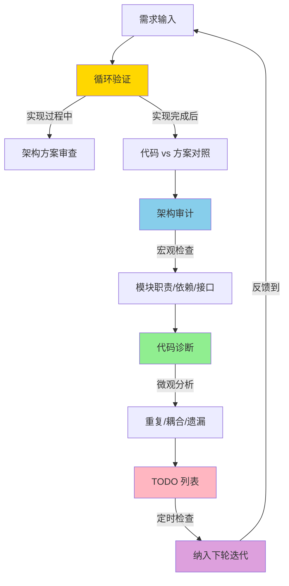

# AI 编程正在制造架构债——怎么还？

用 AI 写代码这事儿，用过的人都有体感：快，真的快。一个功能从想法到能跑，可能就半小时。

但快有快的代价。AI 不在乎你的架构——它只在乎这段代码能不能跑通。时间一长，项目里堆满了"能跑但歪歪扭扭"的代码。模块边界模糊、接口随意、重复实现遍地开花。这就是架构设计负债化：**代码在快速增长，但架构设计在持续腐烂**。

这不是 "AI 写的代码质量差" 那么简单。真正的风险在于：AI 编程天然缺少一种约束机制，让代码在增长过程中保持结构一致性。

下面是我摸索出来的四套机制，外加把它们串成一个大循环的实践方案。

---

## 问题到底出在哪

先说清楚症状。

AI 编程工具（Copilot、Cursor、Claude Code 等）的优化目标是"当前任务的代码正确率"。它不会去想：

- 这个新函数跟已有模块有没有职责重叠
- 这个接口设计跟系统其他地方的风格是否一致
- 加了这层抽象之后，三周后会不会变成维护噩梦

人写代码的时候，这些考量是内嵌在思考过程中的——因为你脑子里有整个系统的上下文。AI 没有。每次对话都是一次 "从零开始理解你的项目" 的尝试，它做的局部决策，放到全局视角下往往是不优的。

结果就是：**代码量涨得越快，架构债累积得越快**。技术债有利息，架构债的利息更高——它会让你未来每一次改动都更难。

---

## 机制一：循环验证

核心想法：**不要让 AI 一次性写完就收工**。写完之后，立即让它验证自己的输出。

具体怎么做？

```
需求分析 → 架构方案 → 代码实现 → 验证检查
    ↑                                    |
    └────────── 反馈修正 ←───────────────┘
```

这个循环的关键不在于 "跑测试"（那太基础了），而在于让 AI 回到架构层面审查自己的实现：

1. **实现前**：先让 AI 输出架构方案——模块怎么分、接口怎么定义、数据怎么流转。人确认后再写代码。
2. **实现后**：把完整代码再喂给 AI（或者另一个 AI 实例），让它对照架构方案检查：有没有偏离方案？有没有遗漏的边界情况？接口是否跟方案一致？
3. **发现问题**：直接修正，或者把问题记录下来进下一轮迭代。

这不是什么新概念——本质上就是 Code Review 的 AI 版。但关键是**形成习惯**。每次 AI 给你一段代码，别直接复制粘贴，先过一轮验证。

实测下来，这一步能拦住 60-70% 的架构偏移。代价是多花 2-3 分钟，收益是省掉后面几小时的返工。

---

## 机制二：架构审计

循环验证解决的是 "单次实现" 的问题。但架构债是个慢性病——它是在无数次 "看起来没问题" 的小改动中慢慢累积的。

所以需要一个**定期审计机制**。

做法很简单：每隔一段时间（我建议每周或每个迭代周期），把项目的核心结构梳理一遍。不是逐行 review，而是从宏观角度检查：

- **模块职责**：每个模块是否还是 "做一件事"？有没有职责膨胀？
- **依赖关系**：模块之间的依赖是否合理？有没有出现循环依赖？
- **接口一致性**：API 风格是否统一？有没有同一个功能出现两套接口？
- **抽象层次**：抽象是否还匹配当前复杂度？有没有过度设计或者设计不足？

谁来审计？AI 自己来。把项目结构喂给 AI，让它输出一份审计报告。关键是要给 AI 足够的上下文——不只是文件树，还要包括核心模块的职责描述、设计意图、已知的技术决策。

审计的输出不是 "你有 N 个问题" 的清单，而是一份带优先级的行动建议：哪些需要立刻处理，哪些可以排进下个迭代，哪些标记为 "观察中"。

---

## 机制三：代码诊断

审计看宏观，诊断看微观。

架构债的另一个来源是**代码层面的暗病**：重复逻辑、过度耦合、遗漏的错误处理、不合理的抽象。这些问题单独看都不大，但积累到一定程度就会让整个模块变得不可维护。

代码诊断的做法：

1. **静态分析**：用 ESLint、SonarQube、CodeClimate 之类的工具跑一遍，拿到基础指标。
2. **AI 诊断**：把静态分析的输出 + 关键模块代码，喂给 AI 做深度分析。让它找出：
   - 潜在的设计模式滥用
   - 重复代码块（即使变量名不同）
   - 不合理的耦合点
   - 缺失的边界处理
3. **输出诊断卡**：每个问题一张卡，包含问题描述、影响范围、修复建议、优先级。

这里有个技巧：让 AI 诊断时，不要只看单个文件。给它一个模块的完整代码，让它分析模块内部的结构问题。单文件视角太窄，发现不了跨文件的设计问题。

---

## 机制四：TODO 列表 + 定时检查

前三套机制都会产生 "待修复项"。如果没有追踪机制，这些待修复项就会石沉大海，架构债还是在涨。

做法：

- **维护一个活的技术债务 TODO 列表**。每个条目包含：问题描述、来源（验证/审计/诊断）、严重程度、预估修复成本。
- **设定定时检查**。每天或每两天过一遍列表，确认：
  - 有没有新条目需要加入
  - 有没有条目已经过时（问题被其他改动间接修复了）
  - 哪些条目应该排进本周的工作计划
- **给 AI 配一个提醒角色**。通过定时任务让 AI 定期扫描代码库，对比 TODO 列表，提醒哪些债该还了。

这个机制的关键是 **"活"**——列表必须跟代码同步更新。一个过时的 TODO 列表比没有列表更危险，因为它给人 "已经在管理了" 的错觉。

---

## 大循环：四套机制怎么串起来

单看每套机制，都不复杂。真正的价值在于把它们串成一个**持续运转的循环**：



说人话就是：

1. **写代码时**，循环验证管住 "别跑偏"
2. **定期回头看**，架构审计管住 "别烂掉"
3. **深入看细节**，代码诊断管住 "别留暗病"
4. **所有问题进列表**，TODO + 定时检查管住 "别忘记"
5. **列表驱动下一轮开发**，形成闭环

这个循环不是线性的（先做 A 再做 B 再做 C），而是**同时在转的**。验证是每次写代码都在做，审计是每周做一次，诊断是按需做，TODO 检查是每天快速过一遍。

四个轮子一起转，架构债就被控制在一个可管理的范围内。不是消除——技术债永远存在——而是让它处在 "你能还得起" 的状态。

---

## 一些实操经验

**别追求完美**。这套机制的目标不是 "零架构债"，而是 "架构债可控"。就像个人理财——你不可能零负债，但你需要确保每月还得起。

**前期投入会比较大**。前 2-3 个迭代会觉得 "这些检查太慢了，直接写代码多快"。但一旦架构债累积到影响开发效率，你会后悔没早做。通常 4-6 周后，这套机制会变成肌肉记忆，额外开销很小。

**AI 审计的 prompt 很关键**。泛泛地问 "这个项目有什么架构问题"，得到的回答通常是废话。需要给 AI 具体的检查清单和上下文。比如：

> "这是项目的模块结构。请检查：1) 模块 A 和模块 B 是否有职责重叠；2) 接口层的风格是否统一（命名规范、参数模式、返回格式）；3) 是否存在循环依赖。"

**TODO 列表需要定期清理**。超过 2 周没动的条目，要么排进计划，要么删掉。留着只会让列表越来越长，最终变成 "再也不看" 的死列表。

---

## 小结

AI 编程工具让代码生产速度提升了一个量级，但架构设计能力没有跟着提升。这个剪刀差就是架构债的来源。

解法不是 "少用 AI"，也不是 "让人审查每行代码"——前者放弃效率，后者不可扩展。解法是建立一套**机制**，让架构质量在代码增长过程中自动受到约束。

循环验证 → 架构审计 → 代码诊断 → TODO 追踪，四套机制形成大循环。简单，可执行，不需要额外工具链。关键是**养成习惯，持续运转**。

架构债跟技术债一样：越早还，利息越低。
