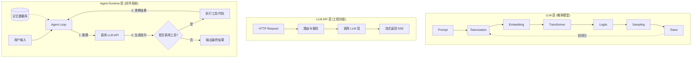

# AI Agent 工程师 Day 1：建立完整认知地图：从 LLM 到 Agent Runtime

> **6 个月学习计划** | M1 - LLM + Agent Runtime | Day 1/168
> 
> **今日主题**: LLM → Agent 的完整演进链路

---

# 建立完整认知地图：从 LLM 到 Agent Runtime

> **核心结论**：LLM 只是一个“无状态的概率推理机”，而 Agent 是一个“具备状态管理、工具调用与循环决策能力的运行时”。从 LLM 到 Agent 的本质跨越，不在于提示词写得多花哨，而在于工程架构的升维。理解 `Prompt → Tokenization → Embedding → Transformer → Logits → Sampling → Token` 的底层生成链路，是看透 LLM 能力边界的基石；而掌握 Agent Loop（代理循环）架构，则是从“调包侠”进阶为 Agent 工程师的必经之路。今天我们将抛弃框架，从第一性原理出发，手撕底层逻辑，建立完整的 AI Agent 认知地图。

## 背景与动机

在为期 6 个月的 AI Agent 工程师路线图中，第一周的核心任务是“破执”——打破对框架的盲目崇拜，建立对系统底层的工程直觉。

当前 AI 工程界存在一种怪象：许多开发者熟练使用 LangChain 或 AutoGen，能跑通各种 Demo，但在面对复杂的业务场景时，却无法定位 Agent 陷入死循环的原因，不知道如何优化上下文窗口溢出，更无法理解为什么 LLM 会产生幻觉并疯狂调用不存在的工具。

这种现象的根源在于**缺乏对底层运行机制的理解**。框架是“捷径”，也是“黑盒”。如果你不理解 LLM 是如何处理 Token 的，不理解 Agent Runtime 是如何调度任务的，你就只能永远停留在“拼装轮子”的阶段，无法构建真正可商用、高可靠的 Agent 系统。

本文将通过拆解 LLM 的底层生成链路，对比 LLM API 与 Agent Runtime 的本质差异，并带你手写一个不依赖任何框架的 Model Client，帮你彻底打通从 LLM 到 Agent 的任督二脉。

---

## 核心内容

### 1. 破除黑盒：LLM 生成的完整链路

要理解 Agent，首先要理解其大脑——大语言模型（LLM, Large Language Model）。LLM 的本质是一个条件概率预测机：给定上文，预测下一个词。这个看似简单的逻辑，背后是一条严密的工程链路。

**Prompt → Tokenization → Embedding → Transformer → Logits → Sampling → Token**

1.  **Prompt（提示词）**：开发者或用户输入的自然语言文本。这是系统的初始边界。
2.  **Tokenization（分词）**：计算机无法直接理解字符，需要将文本切分为模型认识的词元。例如，"hamburger" 可能被切分为 ["ham", "burger"]。这一步决定了模型的计费方式和上下文长度计算。
3.  **Embedding（词向量嵌入）**：将离散的 Token 映射为高维连续空间中的向量。这一步将“语义”转化为“数学坐标”，使得意思相近的词在空间中距离相近。
4.  **Transformer（变换器架构）**：模型的核心计算引擎。通过自注意力机制，计算当前 Token 与上下文中所有 Token 的关联度，最终输出一个包含全局语义信息的隐藏状态。
5.  **Logits（对数几率）**：Transformer 的最后一层会输出词表中每个 Token 作为下一个词的原始未归一化得分。
6.  **Sampling（采样策略）**：将 Logits 通过 Softmax 转化为概率分布，并根据策略（如 Greedy、Top-K、Top-P、Temperature）选出最终的 Token。这一步赋予了模型“创造力”或“确定性”。
7.  **Token（生成词元）**：选出的 Token 被追加到输入序列中，作为新的上文，重新进入步骤 2，开启下一轮预测（自回归生成）。

**工程直觉**：理解这条链路，你就会明白 LLM 没有“记忆”，它每次只看当前输入的 Token 序列；你也会理解为什么修改 Prompt 中的某个词会导致输出剧变（因为 Embedding 和 Attention 权重发生了变化）。Agent 的所有“智能”，本质上都是对这条链路的反复调用。

### 2. 概念辨析：LLM、LLM API 与 Agent

这三个概念在日常交流中常被混用，但在工程架构中，它们处于完全不同的抽象层级。

*   **LLM（大语言模型）**：纯粹的概率模型权重和计算图（如 Llama-3-70B 的 safetensors 文件）。它本身不包含任何 I/O 逻辑，只是一个张量进、张量出的数学函数。
*   **LLM API（大语言模型接口）**：对 LLM 的工程封装。它暴露出 REST 或 RPC 接口，处理了网络路由、负载均衡、Tokenization、Sampling 参数接收、流式输出（SSE）等工程问题。它是开发者直接交互的对象（如 OpenAI 的 `/v1/chat/completions`）。
*   **Agent（智能体）**：以 LLM 为大脑，具备自主规划、工具使用、状态管理和环境交互能力的系统。它不仅调用 LLM API，还包含代码执行环境、记忆数据库、任务调度器等外围工程设施。

**核心区别对比表**：

| 维度 | LLM (模型) | LLM API (接口) | Agent (智能体) |
| :--- | :--- | :--- | :--- |
| **核心本质** | 概率分布预测函数 | 模型能力的网络封装 | 循环决策的运行时系统 |
| **状态管理** | 无状态 | 无状态（单次请求） | 有状态（跨轮次记忆与上下文管理） |
| **执行逻辑** | 张量计算 | 接收文本，返回文本 | 解析意图，路由工具，执行代码，观察结果 |
| **控制流** | 单次前向传播 | 请求-响应模型 | 循环控制流 |
| **工程边界** | GPU 显存 | API 网关与推理引擎 | 操作系统、文件系统、外部 API |

### 3. Agent 为什么不是"一个 Prompt + 一个 API"

许多人认为，只要写一个很长的 Prompt，包含各种指令，然后调用 OpenAI API，得到的结果就是 Agent。这是一个典型的认知误区。

**因果链剖析**：
如果 Agent 仅仅是一个 Prompt + API，那么系统的行为模式是：**输入 → LLM 推理 → 输出**。这是一个开环系统。这意味着，无论 LLM 输出什么，系统都直接作为最终结果返回。如果 LLM 产生幻觉，系统就会传递幻觉；如果 LLM 说“我需要查一下天气”，系统只能返回这句话，而无法真正去查天气。

真正的 Agent 必须是一个**闭环系统**。它的架构不是线性的，而是一个循环：

1.  **感知**：接收用户输入或环境反馈。
2.  **推理**：LLM 基于当前上下文进行思考，决定下一步行动。
3.  **行动**：解析 LLM 的输出，如果是工具调用，则执行工具（如查询数据库、运行 Python 代码）。
4.  **观察**：获取工具执行的结果。
5.  **迭代**：将工具结果作为新的观察反馈给 LLM，回到步骤 2。

这个 **推理-行动-观察** 的循环，就是著名的 ReAct 模式。

**结论**：Agent 的核心不在于 Prompt 多么复杂，而在于**引入了基于 LLM 输出的控制流转移**。LLM 不再是生成最终答案的终点，而是生成“下一步指令”的中间件。Agent 系统通过代码解析 LLM 的输出，执行相应操作，并将结果喂回给 LLM。这种“代码包裹模型”的架构，才是 Agent 的本质。

### 4. 从 LLM 到 Agent Runtime 的演进路径

理解了 Agent 的循环本质，我们就能看清从 LLM 到 Agent Runtime 的工程演进路径。Agent Runtime 就是承载 Agent 循环运行��软件环境。

**阶段一：单次调用**
开发者直接使用 `requests.post` 调用 OpenAI API。系统是无状态的，每次调用独立。

**阶段二：多轮对话**
开发者引入消息列表 `messages = [{"role": "user", "content": "..."}]`，在每次调用时将历史消息拼接传入。系统具备了伪状态（依赖上下文窗口）。

**阶段三：工具增强**
开发者引入 Function Calling。LLM 输出结构化的 JSON 指明要调用的函数，开发者编写代码执行函数，并将结果以 `role: "tool"` 的形式追加到消息列表中，再次调用 LLM。此时，系统引入了简单的控制流分支。

**阶段四：Agent Runtime**
随着工具增多、上下文变长、任务变复杂，简单的控制流难以维护。Agent Runtime 应运而生。它负责：
*   **生命周期管理**：管理 Agent 的启动、暂停、恢复。
*   **状态机维护**：管理复杂的任务状态（如等待工具返回、等待用户确认）。
*   **记忆管理**：长短期记忆的写入、检索与遗忘。
*   **并发与调度**：多 Agent 协作时的资源分配与消息传递。

**工程直觉**：Agent Runtime 本质上是一个特殊的操作系统。传统操作系统调度的是进程和线程，依据的是 CPU 时间片和中断；而 Agent Runtime 调度的是 LLM 推理和工具执行，依据的是 LLM 输出的意图和工具执行的完成状态。

### 5. 不使用框架，手写最简单的 Model Client

理论需要实践支撑。为了打破对框架的依赖，我们将不使用任何第三方 AI 库（如 openai, langchain），仅用 Python 标准库 `urllib` 和 `json`，手写一个支持流式输出的 Model Client。这能帮你彻底看清 LLM API 的交互本质。

```python
import json
import urllib.request

class RawModelClient:
    def __init__(self, base_url, api_key):
        self.base_url = base_url
        self.api_key = api_key

    def stream_chat(self, messages, model="gpt-4o-mini", temperature=0.7):
        """
        不依赖任何框架，直接通过 HTTP 调用 LLM API 并处理流式返回
        """
        url = f"{self.base_url}/chat/completions"
        headers = {
            "Content-Type": "application/json",
            "Authorization": f"Bearer {self.api_key}"
        }
        payload = {
            "model": model,
            "messages": messages,
            "temperature": temperature,
            "stream": True # 开启流式输出
        }

        data = json.dumps(payload).encode("utf-8")
        req = urllib.request.Request(url, data=data, headers=headers, method="POST")

        try:
            with urllib.request.urlopen(req) as response:
                # 流式响应以 SSE (Server-Sent Events) 格式返回，每行以 data: 开头
                for line in response:
                    line = line.decode("utf-8").strip()
                    if line.startswith("data: "):
                        data_str = line[6:]
                        if data_str == "[DONE]":
                            break
                        chunk = json.loads(data_str)
                        # 解析出增量内容
                        delta = chunk["choices"][0]["delta"].get("content", "")
                        if delta:
                            yield delta # 使用生成器返回每个 Token 片段
        except Exception as e:
            print(f"API 请求错误: {e}")

# --- 使用示例 ---
if __name__ == "__main__":
    client = RawModelClient(
        base_url="https://api.openai.com/v1",
        api_key="sk-your-api-key"
    )
    
    messages = [
        {"role": "system", "content": "你是一个严谨的 AI 工程师。"},
        {"role": "user", "content": "解释什么是 Tokenization。"}
    ]
    
    print("Agent 回复: ", end="", flush=True)
    for token in client.stream_chat(messages):
        print(token, end="", flush=True)
    print("\n完成。")
```

**代码解析**：
这段代码没有引入任何 `openai` 库的魔法。它做的事情就是：
1.  构造 HTTP 请求。
2.  设置 `stream: True`。
3.  读取网络流，解析 `data: ` 前缀的 SSE 协议。
4.  提取 `delta` 中的增量文本并 `yield` 返回。

这就是所有高级框架（如 LangChain 的 `ChatOpenAI`）底层的真实面貌。理解了这一点，你就拥有了在框架出 Bug 时直接排查网络层和协议层问题的能力。

---

## 代码/图示

### LLM 到 Agent 演进架构图



### Agent Loop 伪代码

```python
def agent_loop(user_input):
    context = [system_prompt, user_input]
    
    while True:
        # 1. 推理: LLM 基于上下文决定下一步
        llm_output = call_llm_api(context)
        context.append(llm_output)
        
        # 2. 行动: 检查是否需要调用工具
        if llm_output.tool_calls:
            for tool_call in llm_output.tool_calls:
                # 执行具体的本地代码或外部 API
                result = execute_tool(tool_call.name, tool_call.args)
                # 3. 观察: 将工具结果作为新消息加入上下文
                context.append({"role": "tool", "content": result})
        else:
            # 如果 LLM 没有要求调用工具，说明任务完成，退出循环
            return llm_output.content
```

---

## 实践练习与思考题

为了巩固今天的认知，请完成以下练习：

1.  **画图练习**：在纸上或使用绘图工具，画出你理解的 LLM 到 Agent 演进图。标注清楚每一步的数据流向和状态变化。
2.  **代码练习**：运行本文提供的 `RawModelClient` 代码（可使用 OpenAI 或兼容 OpenAI 格式的国产模型 API，如 DeepSeek、智谱等）。尝试修改 `temperature` 参数，观察输出的随机性变化。
3.  **深度思考**：如果 LLM 的上下文窗口是无限的，我们还需要 Agent Runtime 中的“记忆管理”模块吗？为什么？（提示：考虑注意力机制的计算复杂度 $O(N^2)$ 和信噪比问题）。

---

## 与 Agent Engineering 的关联

今天建立的认知地图，是整个 AI Agent 工程的基石。

*   **理解 Tokenization 和 Sampling**：直接影响你在 Agent 系统中设计 Prompt 的策略。你会知道为什么 JSON 格式的工具描述需要尽量简短（因为消耗 Token），也会知道在需要严格逻辑推理时应该将 Temperature 设为 0。
*   **理解 Agent Loop**：是构建任何复杂 Agent 系统的核心。无论是单 Agent 的 ReAct，还是多 Agent 的 Supervisor 架构，底层都是这个“推理-行动-观察”的循环。后续学习 LangGraph 等框架时，你会明白它们本质上是在用图结构来编排这个循环。
*   **理解 Runtime 状态**：决定了你能否构建出可商用的 Agent。Demo 往往是单轮的，而生产级 Agent 必须处理网络超时、工具执行失败、用户中途打断等异常状态。这就是 Runtime 的价值。

掌握了这些底层逻辑，你就不再是一个只会调 API 的“炼丹师”，而是一个能够掌控系统生命周期的“架构师”。

---

## FAQ

**Q1: 为什么不推荐直接用 Prompt 让 LLM 输出工具调用的 JSON，而是要用 API 提供的 Function Calling 功能？**
**A:** 虽然 Prompt 可以让 LLM 输出 JSON，但 LLM 的输出具有概率性，容易产生多余的文本（如 "好的，这是你要的 JSON:"）或格式错误。API 提供的 Function Calling 是在模型层面进行了微调和对齐，并在推理引擎层做了约束解码，保证了 JSON 格式的 100% 合法性，极大提升了 Agent 系统的稳定性��

**Q2: 既然 Agent 本质是循环，那是不是循环次数越多，Agent 就越聪明？**
**A:** 不是。循环次数多往往意味着任务被拆解得过细，或者 LLM 在某一步卡住了。过多的循环会消耗大量 Token，增加延迟，且容易导致上下文窗口溢出或“思路漂移”。优秀的 Agent 设计追求的是用最少的步骤完成任务。

**Q3: 上下文窗口已经达到 128K 甚至 1M 了，还需要向量数据库来做长期记忆吗？**
**A:** 需要。上下文窗口再大也是有限的，且存在“Lost in the Middle”现象（中间位置的文本容易被忽略）。更重要的是，向量数据库不仅是存储，更是“检索”。它允许 Agent 在海量历史数据中精准提取相关信息，而不是把所有历史都塞进 Prompt，这兼顾了成本、速度和准确率。

**Q4: 手写 Model Client 看起来很简单，但生产环境要考虑重试、并发、限流，是不是还是得用框架？**
**A:** 生产环境确实需要处理这些工程细节。手写 Client 的目的不是让你在生产环境重造轮子，而是让你理解轮子的原理。当你使用框架（如 OpenAI SDK 或 LiteLLM）时，你应该清楚地知道它们在背后做了什么。理解底层能让你在遇到框架 Bug 时游刃有余，而不是束手无策。生产环境推荐使用成熟的 SDK 处理网络层逻辑，但 Agent 的控制流逻辑仍需自己掌控。

**Q5: Agent Runtime 和传统的 Web Server 后端有什么区别？**
**A:** 传统 Web Server 是“请求-响应”模型，通常是短连接、无状态的。而 Agent Runtime 是“会话导向”的，通常需要维持长连接（如 WebSocket），管理复杂的会话状态，且任务执行时间往往较长（可能几分钟甚至几小时）。Agent Runtime 需要处理异步事件流、工具执行的中间状态反馈，以及基于 LLM 意图的控制流转移，这些都是传统 Web Server 不具备的。

---

## 📋 本日知识点清单

- [ ] Prompt → Tokenization → Embedding → Transformer → Logits → Sampling → Token 的完整流程
- [ ] LLM、LLM API、Agent 三个概念的本质区别
- [ ] Agent 为什么不是"一个 Prompt + 一个 API"
- [ ] 从 LLM 到 Agent Runtime 的演进路径
- [ ] 不使用框架，手写最简单的 Model Client

## 📝 实践练习

画一张自己的 LLM → Agent 演进图，不用框架写一个最简单的 Model Client。

---

*本文是「AI Agent 工程师」6 个月学习计划的一部分。学习路线：LLM → Inference → Runtime → Harness → Memory → Environment → Evaluation → Production。目标：Agent / AI Systems Engineer。*
