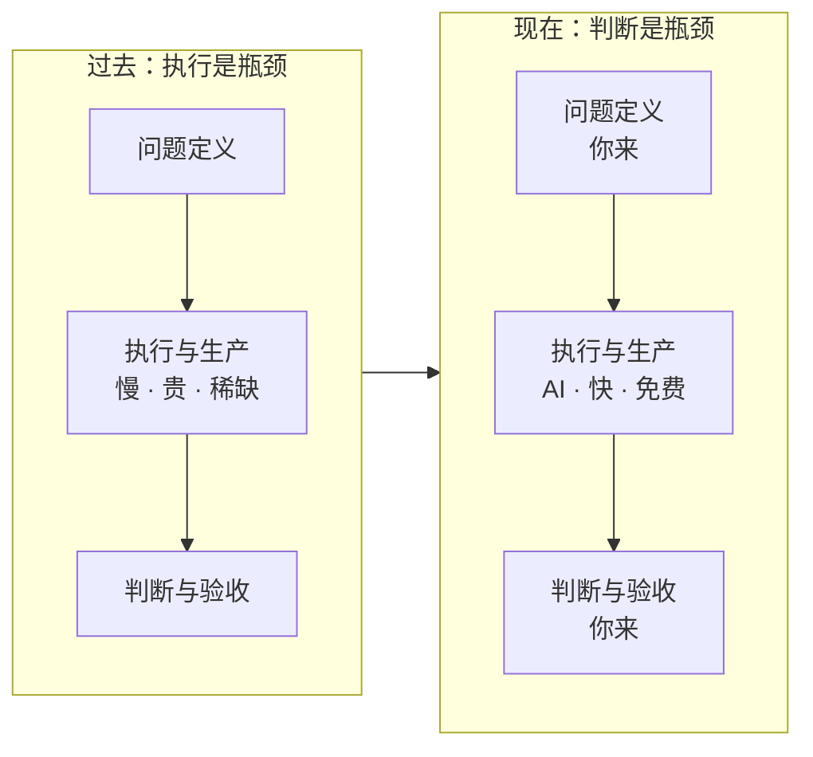
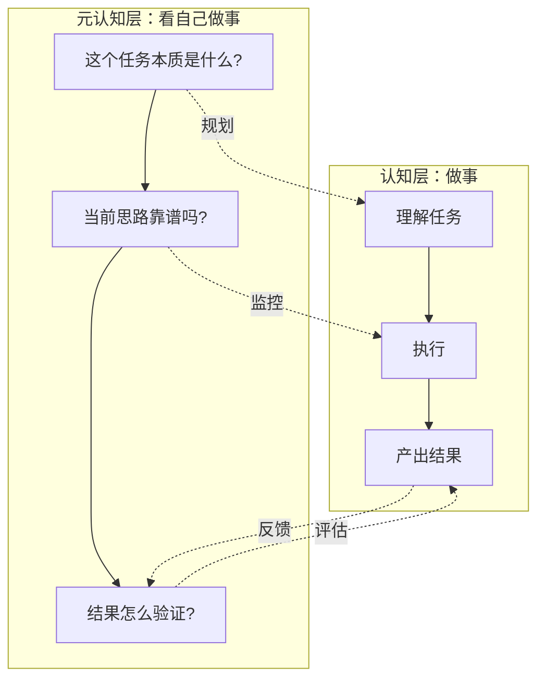
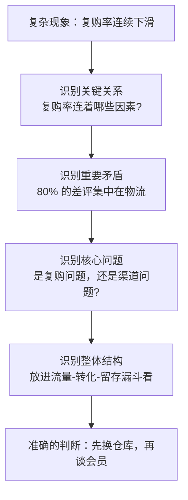
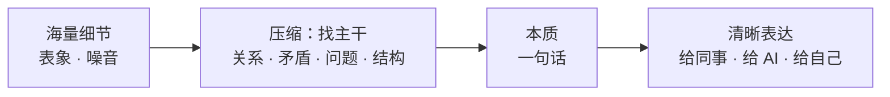
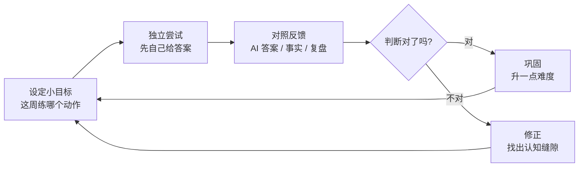

问 AI 一个问题，两分钟之内你能拿到十个方案，每个都头头是道。然后呢？

你盯着屏幕，发现真正的难题才开始：哪个方案是对的？哪个适合你现在的处境？哪个看着漂亮其实是坑？

三年前，卡住大多数人的是"不知道怎么办"。现在，卡住大多数人的是"分不清哪个更好"。生成已经免费，判断成了瓶颈。

这件事值得认真聊聊。

## 一、稀缺性搬家了

工业时代稀缺的是体力，信息时代稀缺的是知识，现在轮到"知道该怎么用知识"。

AI 把"做"的成本打到接近零：写代码、写文案、做方案、画图，边际成本趋近于零。而价值永远跟着稀缺性走——当一样东西不再稀缺，价值就转移到它旁边还没被替代的环节。

那个环节就是判断：

- 该解决什么问题（问题定义）
- 该信哪个答案（质量评估）
- 该走哪条路（方案选择）
- 做完算不算好（验收标准）

哈佛商学院和波士顿咨询 2023 年做过一个实验：758 名咨询顾问，一部分配了 GPT-4。结果很有意思。对 AI 擅长的任务，用 AI 的顾问产出质量高了 40% 左右；但对超出 AI 能力边界的问题，用 AI 的人反而比不用的人更容易答错——错误率高了大约 19 个百分点。

同一批人，同一批工具，任务一换，AI 从帮手变成陷阱。

论文给这个现象起了个名字：参差的技术边界（jagged technological frontier）。AI 的能力不是一条平滑曲线，是一片深浅不一的沼泽——哪里能踩，哪里不能踩，地图上没画，只能靠你自己的判断力。判断力弱的掉坑里，判断力强的捡漏。

## 二、元认知：对思考的思考

认知科学家 Flavell 在 1979 年提出一个概念：元认知（metacognition）。说白了就是对思考的思考——不但要想，还要知道"自己是怎么想的、想得对不对、为什么这么想"。

人的认知分两层：

- **认知层**：做事本身。读、写、算、推理、解题。
- **元认知层**：看着自己做事。现在卡在哪？这个思路靠谱吗？要不要换条路？答案出来了我怎么验证？

为什么 AI 时代，这个能力从"美德"变成了"刚需"？

因为 AI 的输出太流畅了。心理学上有个流畅性启发式（fluency heuristic）：人倾向于把"读起来顺"当成"是对的"。而 AI 恰恰是最擅长把错误写得流畅的东西——它错了也理直气壮，还引经据典。

没有元认知的人，读着顺就信了。有元认知的人，会在心里多问一句：这个结论怎么推出来的？证据呢？换个说法我还会信吗？

卡尼曼说的系统 1（快而省）和系统 2（慢而费劲）就是这个过程的机制。AI 的流畅感专门喂饱系统 1，让系统 2 躺平。元认知，就是手动唤醒系统 2 的那根手指。

## 三、判断力的解剖：四重识别

判断力听着玄，其实可以拆开。我认为核心是四重识别。

用一个贯穿的例子：你开了一家电商店铺，复购率连续三个月下滑。问 AI，它能给你二十个"提升复购"的方法——会员体系、优惠券、私域运营……都对，也都没用。因为你的问题出在哪，还不知道。

### 3.1 识别关键关系：要素是假的，关系才是真的

系统思维的核心洞察（德内拉·梅多斯《系统之美》）：决定系统行为的不是要素，是要素之间的关系。

复购下滑，一般人盯着"复购率"这个数字想办法。会看关系的人会问：复购率和什么连着？物流时效、商品质量、客服响应、竞品价格、新客来源结构……把这些关系画出来，才会看到"复购率"只是结果，原因藏在关系网里。

孤立地看要素，得到的是一张"可以做什么"的清单；看清关系，得到的是一张"问题出在哪"的地图。前者是 AI 就能给的东西，后者才是你要带给 AI 的东西。

### 3.2 识别重要矛盾：一堆问题里，只有一个主要矛盾

《矛盾论》里有个判断：任何过程如果有多数矛盾存在，其中必定有一种是主要的、起领导作用的，抓住了这个主要矛盾，一切问题就迎刃而解。

复购下滑可能有十个原因同时在起作用，但这个季度的差评 80% 集中在"发货太慢"。那其他九个原因先放一放，主要矛盾就是物流。矛盾还会转移——物流解决之后，主要矛盾可能变成上新速度。

抓主要矛盾的要点不是"统筹兼顾"，而是敢于在一段时间内对其他问题视而不见。这是 AI 替代不了的取舍：它不知道你的资源，不知道你的时间窗口，更不承担选择的后果。

### 3.3 识别核心问题：问题定义错了，答案再好也白搭

"复购率下滑"未必是真问题。也可能是最近拉的新客质量变差（引流渠道换了），基数一变，复购率自然走低——那要解决的根本不是复购，是渠道。

有句话常被归于爱因斯坦："如果给我一小时解决问题，我会花五十五分钟思考问题本身。"出处已不可考，道理不假。

操作上有个笨办法：连问五个为什么（5 Whys，丰田的根因分析法）。复购为什么下滑？因为老客不回来。为什么不回来？因为到货慢。为什么到货慢？因为换了仓库。问到这一层，答案自己浮出来：不是做会员体系，是把仓库换回去。

你发现没有，prompt engineering 的核心就是这个能力。AI 回答的质量，上限是你提问的质量。问不出好问题，就没有好答案——背后是同一件事：你对自己问题的理解深度。

### 3.4 识别整体结构：先看森林，再看树木

麦肯锡的金字塔原理、MECE 原则，说的都是一件事：把单点信息组织成结构，判断才有立足点。

把复购问题放进"流量 → 转化 → 留存 → 复购"的整体漏斗里看，你可能会发现复购下滑和转化下滑是同一个问题的两个影子。没有结构，你面对的是二十个孤立的麻烦；有了结构，你面对的是一个系统。

四重识别有个共同点：都是"在动手之前，先想清楚"。这恰好就是元认知的定义。

## 四、深入浅出：理解的硬指标

判断力还有一层输出形态：表达。

真懂一个东西的标志，是能把它讲给外行听懂，还不失真。费曼技巧的核心就这一条：讲不明白，就是没懂。

这背后有点信息论的味道——深入浅出是一次压缩：把海量细节压缩成几句本质，同时保住结构。压缩得好，说明你抓住了主干；只能罗列细节，说明你还没找到主干。

AI 时代，这层能力有了新含义：**你的表达是 AI 的输入接口。**

你描述问题的方式，直接决定 AI 输出的质量。说不清需求的产品经理，拿到的是似是而非的原型；能把问题拆到"谁、在什么场景、碰到什么障碍、要什么结果"的人，拿到的是能用的方案。

深入浅出不是为了显得厉害，是跟 AI 协作的基本功。

## 五、顺手的警告：越省力，越退化

微软研究院 2025 年发在 CHI 的一个调研：319 名知识工作者，936 个真实用例。两个结论：对 AI 越信任，人自己动用批判性思考的意愿越低；大家普遍感到"认知努力"在下降——活变轻松了，思考变少了。

这不是新现象。GPS 出现后人的空间记忆变差，计算器普及后心算退化，都一样。认知外包有条残酷的规则：你外包掉的不只是任务，还有练这个任务的机会。

学习科学里有个概念叫合意困难（desirable difficulties，Bjork 提出）：有些困难恰恰是学习的机制本身。把困难全消灭掉，能力也一起没了。

所以关键从来不是"用不用 AI"，而是用的时候你的脑子在不在场。一个我认为健康的姿势：

- **AI 做草稿，你做裁判**——永远不跳过裁判这一步
- **先自己想，再看 AI**——哪怕只写三行，也先写
- **对 AI 的答案做预测**——先猜它会说啥，再看它说啥，差异之处就是你认知的边界

## 六、怎么练：独立思考 + 刻意练习

前面说的这些能力，没有一个是天生的，也没有一个能靠读文章获得（包括这篇）。只能靠练。

Ericsson 研究"刻意练习"几十年，看了小提琴手、象棋大师、外科医生，发现顶尖水平的共同点不是天赋，是练习的结构：有明确的小目标、有即时反馈、待在舒适区边缘、可以重复。天赋决定起点，练习结构决定终点。

把这套结构搬到思维练习上，是五个可以明天就开始的动作：

1. **决策日志。** 每次重要判断，写下：我为什么这么判断、我预计会发生什么。一个月后回头看。这是给判断力装"即时反馈"——没有反馈的判断练一万次，也只是把去年重复了一万遍。

2. **先想后问。** 问 AI 之前，先强迫自己写一个答案。不用对，但必须有。然后对比 AI 的答案，差异的地方就是你思维和最好水平之间的缝隙。长期这么干，缝隙会越来越小。

3. **三句话复述。** 每读完一份复杂材料，合上，用三句话讲给一个假想的外行。讲不出来就回去重读。这是元认知最快的检票口。

4. **每周抓一次主要矛盾。** 问自己：这周所有的事里，哪一件是主要矛盾？其他事可以烂到什么程度？练的是取舍，不是时间管理。

5. **给 AI 挑错。** 每周至少一次，刻意在 AI 的输出里找一个真错误——不是格式问题，是事实或逻辑错误。找不到就换个你熟的领域再找。这个练习直接校准你对 AI 的信任边界：什么时候能全信，什么时候必须逐句看。

这五件事的共同点：都是保持独立思考的动作。独立思考不是不听别人的，是任何外部答案进入你脑子之前，先过一道自己的加工。

## 结尾

AI 会越来越强，答案会越来越便宜，这在可见的未来不会逆转。

但有一件事它替代不了：为你自己的判断负责。AI 可以替你写方案，不能替你签字；可以替你查资料，不能替你拍板。元认知也好，四重识别、深入浅出也好，这些能力的共同点是——它们都站在"负责"这个位置上。

工具放大的是你本来就有的东西。想清楚的能力，就是那个被放大的本体。

它退化的时候不会有人提醒你。但用得上的那一刻，它就是你和正确答案之间的全部距离。

## 参考资料

1. Flavell, J. H. (1979). Metacognition and cognitive monitoring: A new area of cognitive–developmental inquiry. *American Psychologist*, 34(10), 906–911.
2. Dell'Acqua, F., McFowland III, E., Mollick, E., et al. (2023). Navigating the Jagged Technological Frontier: Field Experimental Evidence of the Effects of AI on Knowledge Worker Productivity and Quality. *Harvard Business School Working Paper 24-013*.
3. Lee, H.-P., Sarkar, A., Tankelevitch, L., Drosos, I., Rintel, S., Banks, R., & Wilson, N. (2025). The Impact of Generative AI on Critical Thinking: Self-Reported Reductions in Cognitive Effort and Confidence Effects From a Survey of Knowledge Workers. *Proceedings of CHI 2025*.
4. Ericsson, K. A., Krampe, R. T., & Tesch-Römer, C. (1993). The role of deliberate practice in the acquisition of expert performance. *Psychological Review*, 100(3), 363–406.
5. Kahneman, D. (2011). *Thinking, Fast and Slow*. Farrar, Straus and Giroux.
6. Meadows, D. H. (2008). *Thinking in Systems: A Primer*. Chelsea Green Publishing.
7. 毛泽东 (1937). 《矛盾论》.
8. Bjork, R. A. (1994). Memory and metamemory considerations in the training of human beings. In J. Metcalfe & A. Shimamura (Eds.), *Metacognition: Knowing about Knowing*. MIT Press.
9. Minto, B. (1987). *The Pyramid Principle: Logic in Writing and Thinking*. Pitman.
