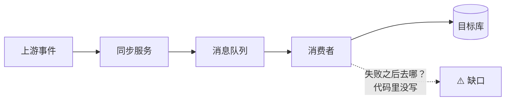
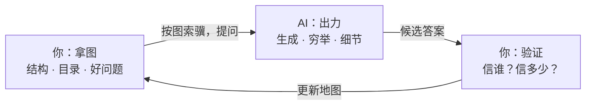

上个月有个下午，我到现在还记得。

我用 AI 编程工具改一个数据同步模块。需求描述完，提示词写好，回车。一分钟后，屏幕上刷出两千多行代码。编译通过，测试跑过，看起来一切正常。

按理说我该高兴。可是盯着这两千行代码，我心里发毛：这些代码真的对吗？要不要逐行看一遍？

我开始逐行看。看到第 400 行的时候，前面那个函数叫什么来着？往上翻。翻回来，又忘了刚才看到哪了。看到第 900 行，我开始走神，起身倒了杯水。看到第 1500 行，我承认，我已经不是在 review 了，我是在浏览——眼睛在动，脑子没动。

那天我 review 了两个小时，最后说了句"看起来没问题"，合上电脑。说实话，心里没底。

后来我换了个办法，效率完全不一样了。这个办法说出来特别简单：**先把代码画成图，再按图审代码。**

这篇文章就讲这件事：为什么在 AI 时代，"图像思考"和"图谱记忆"突然变得这么重要，以及怎么练。

## 一、AI 是一个字一个字地想问题的

先说清楚 AI 是怎么"思考"的，这决定了我们该怎么跟它配合。

现在的主流大模型——GPT、Claude、GLM 这些——底下都是同一种架构，叫 Transformer。它的工作方式说穿了很简单：**一个 token 一个 token 地往外蹦。**每生成一个词，它都要把前面所有的内容重新看一遍，然后猜"下一个词最可能是什么"。猜完一个，接上，再猜下一个。

它没有草稿纸，没有画布，没有那种"我在脑子里把整个系统转一圈"的动作。它是高水平的接龙选手：局部极为流畅，每一段都接得天衣无缝。

这带来一个特点：**AI 极擅长局部，但表达"全局长什么样"很吃力。**

你让它写一个函数，它写得又快又好。你让它讲一个系统，它会给你八百字，信息都在，每句话都对，但你读完记不住结构——因为它的输出本身就是一条 token 长龙，是一条线，不是一张图。

## 二、先画图，再审码

于是出现了这么一个现象，不知道你有没有同感。

AI 编程工具普及之后，写代码变快了，但**看代码**变累了。以前自己写代码，写的过程就是理解的过程，代码是在脑子里长出来的，不需要专门 review。现在 AI 一分钟写完两千行，理解的活儿全留给了你。

review AI 的产出，正在变成一种新的、高强度的智力劳动。而且这种劳动特别消耗人——因为它是**串行**的：一行一行读，读完后面忘前面。

我的转折点，就出在前面那个下午之后。

又来了一次类似的 review 任务。这次我没有直接读代码，先干了件别的：花十分钟，照着 AI 的改动说明，在纸上画了一张图——数据从哪进来，经过哪几个模块，存到哪，谁消费它。画的过程中有两处流程我猜不出来，就回去追问 AI，让它补说明。

然后我拿着这张图去审代码。**不看代码像什么，只看代码跟图对不对得上。**

那张图大概长这样：

十几分钟，我就抓到一个问题：图上那个"缺口"是真的——消费者处理失败之后没有重试、没有回退，队列一旦堵死就静默丢数据。这种问题，逐行读的时候特别容易漏，因为每一行都是"对的"；但在图上，那个缺口一目了然，就像地图上断掉的一座桥。

这之后我固定了这个流程：先画图，再审码。图和代码对不上的地方，就是 bug 的高发区。

## 三、结论：人的优势在"图"，不在"字"

讲到这里，可以把结论亮出来了。

AI 时代，人机分工的边界正在重新画。凡是能拆成 token 流的事——写字、列细节、穷举方案、生成代码——AI 比你快得多，也不知疲倦。这些活儿，别抢。

人真正占优势的是两件事，它们恰好都是"图"的事：

**第一，形象思考。**在脑子里建一张图：全局的、并行的、可以旋转和缩放的。系统的结构、问题的脉络、流程的走向，以图的方式存在脑子里。想问题是从图上往下看，而不是从第一行代码往后爬。形象思考天然就是顶层思考——图是有高度的，站在图上看，哪个环节薄弱、哪条路走不通，一眼就能看到。

**第二，图谱记忆。**AI 懂的东西太多了，我们背不过，也不用背。你要记的不是知识本身，而是知识的**图**：这个领域分几块，每块管什么，块和块之间怎么连。就像用百科全书：没人背百科全书，但人人会用——你知道它的目录，知道分类法，知道从哪一类往下找。记住目录和图谱，按图索骥，细节到时候让 AI 去翻。脑子里有图的人，才能跟 AI 打配合：你拿着地图，它负责跑腿。

注意右边那个"验证"：AI 给的答案不能直接信，得有人把关。思考方法论加上验证的习惯，这是 AI 时代要攥在自己手里的两样东西。

## 四、这不是玄学：图为什么比字好使

你可能会说，图好使这个感觉我也有，但有什么科学依据吗？还真有，而且是一大摞。

**双重编码理论。**心理学家佩维奥（Allan Paivio）1971 年提出：人的记忆有两条通道，语言的和图像的。一条信息如果两条通道都编码过，提取的时候就上了双保险。你只读过文字描述的系统，只存在语言通道里；你画过图、看过图，两条通道都有货。记得牢，想得快。

**图片优势效应。**实验心理学里反复验证的老结论：人对图像的记忆显著好于文字。给你看 30 张图片和 30 个词，过几天再测，图片的回忆率遥遥领先。

**心理旋转实验。**1971 年，谢巴德（Shepard）和梅茨勒（Metzler）做了个著名实验：给受试者看两个三维积木的图，问是不是同一个东西转了个角度。结果，判断所需的时间和旋转的角度成正比——人真的是在脑子里"转"那个物体。这说明图像不是思考的装饰品，图像本身就是思考的载体。

**工作记忆的窄门。**认知科学测出来，人的工作记忆大概只能同时拿住 4 个左右的信息块（老教科书说 7±2，新研究更悲观，说 4±1）。这就是为什么逐行读码读到 900 行会崩——信息早溢出了。但组块化能扩容：国际象棋大师看一眼棋盘能记住整个局面，不是记性比你好，是人家脑子里存的是"定型局面"这种大组块（Chase 和 Simon 1973 年的经典研究）。一张系统图，就是一个把几十行代码压缩进去的大组块。

**认知负荷理论。**斯威勒（Sweller）1988 年提出：学习和思考的瓶颈在工作记忆负荷。图示的作用就是把负荷卸载到外部——纸上的图替你的脑子拿着全局，脑子腾出来干真正要紧的活。

**大脑天生是绘图师。**这是最有意思的一层。神经科学发现，海马体里有"位置细胞"和"网格细胞"，专门负责把你的经历组织成一张空间地图——这项发现拿的是 2014 年诺贝尔生理学或医学奖。换句话说，**用空间结构来组织知识，是大脑的原生格式。**记忆宫殿这个流传两千年的记忆术为什么灵？就是拿空间地图装信息，顺着大脑的原生格式来。世界记忆大赛的冠军们，几乎人人用这一招。

顺手举两个历史人物的例子。法拉第没受过正规的数学训练，他把看不见的磁场画成一根根"力线"，像一张摸不着的网——麦克斯韦后来那组著名的方程，就建在这幅图像上。爱因斯坦在给数学家阿达马的信里说过，他思考时用的不是词，而是"多少有些清晰的图像和符号"，语言是事后才追上来的。费曼图更直接：费曼把粒子物理画成一张图，这张图至今是全行业的作业格式。

这一摞证据指向同一句话：**图不是让思考好看一点的辅助，图就是思考本身运行的格式。**

## 五、怎么练：五个动作

方法论不值钱，练法才值钱。下面是我自己在用的五个动作，都很朴素。

**动作一：先画后读。**review AI 产出之前，强制自己先画图，十分钟就够。画不出来的地方，说明你对需求的理解有洞——先补洞，再进代码。然后按图审码，盯差异，不盯文字。

**动作二：目录式记忆。**学任何新东西，第一遍只记目录：分几块、叫什么、互相什么关系。第二遍才进细节。检验方法：合上资料，把结构默画出来。画不出来的地方，就是没懂的地方。

**动作三：每日一图。**每天把最值得记的一件事画成图，存进笔记库。工具无所谓，纸笔反而更好——画得慢不是缺点，"必要难度"理论说了，加工费劲的记忆才留得住。

**动作四：用图说话。**写设计文档、提 review 意见，逼自己附一张图。给别人讲明白不算真明白，画明白才算。画的过程会立刻暴露你理解里含糊的部分。

**动作五：空间锚定。**把一个项目的关键概念，钉死在一张固定的图上——哪块在左上角、哪条线穿中间。以后回忆这个项目，先"回到"那张图，再从图上取货。这就是你自己的记忆宫殿。

补一句：有朋友说"我是 aphantasia，脑子里没有画面，怎么办"。别慌，答案是把图像外化——画在纸上，让纸替你"看"。图的价值在于把结构摊开，不在于内视力好不好。

## 六、再讲一个例子：人加机器怎么赢

最后讲一个跟写代码无关的例子，我觉得它把这件事讲得更透。

国际象棋圈有个词，叫"半人马"（Centaur）：人 + 机器组队下棋。1998 年，卡斯帕罗夫办了第一届这样的比赛，叫"高级象棋"（Advanced Chess）。

2005 年有一场自由式人机团体赛，结果出乎所有人意料：冠军不是特级大师带着顶级引擎，而是**两位业余棋手，带着三台普通电脑。**他们把三台机器给出的走法来回比较、互相校验，自己当裁判。大师队输了。

复盘的时候大家发现，业余组合赢就赢在流程上：他们不跟机器比算力，他们管地图——什么局面该问哪台机器、哪些建议直接扔掉、什么时候信机器什么时候不信。卡斯帕罗夫后来专门写过文章复盘这场赛局，说那两位业余棋手的本事，在于调试自己的人机流程。

**人拿图，机器算路。**你看，这跟 review 代码是一回事，跟未来的所有工作都会是一回事：AI 负责算力和细节，人负责地图和验证。手里没有图的人，连指挥 AI 的资格都没有——你都不知道该问它什么、该不信它什么。

## 七、长期收益：你的图谱会复利

这套东西坚持下来，收益是什么？

短期看，是 review 的漏检率降下来、学新东西快起来。但真正值钱的是长期那条线：**图谱是会复利的资产。**

每学一个新领域，往图上加一块；每个新概念，在图上找到它的挂点。三五年下来，你脑子里的知识是一张连成网的图，不是一堆孤立的抽屉。新东西来了，往网上一放，就知道它跟什么相连、值几个钱、可不可信。这跟知识图谱是一个道理：孤立的点不值钱，点和点的连线才值钱。

我之前写过一篇《[答案免费了，脑子为什么更值钱？](https://www.daoyuly.cn/2026/2026-09-23-free-answers-priceless-brain/)》，里面有个判断：AI 把答案的成本打到接近零之后，值钱的只剩下提出好问题、判断好答案的能力。今天这篇可以算它的续集：**判断力和好问题，都是从那张图上长出来的。**

AI 擅长的，大方地让给它。我们守住 AI 不擅长的：形象思考、结构记忆、各类思考方法论，还有那个最要紧的——验证的习惯。

一句话收束全文：**别跟 AI 比背百科全书，做一个记得住全书目录的人。**

今天的作业：把你手头正在做的那个项目，画成一张图，贴在墙上。下篇（二）打算讲讲，我是怎么把这套方法落成一个具体的个人图谱系统的。

## 参考资料

1. Paivio, A. *Imagery and Verbal Processes*. 1971.（双重编码理论）
2. Shepard, R. N. & Metzler, J. "Mental Rotation of Three-Dimensional Objects". *Science*, 1971.（心理旋转）
3. Chase, W. G. & Simon, H. A. "Perception in Chess". *Cognitive Psychology*, 1973.（组块与棋艺）
4. Cowan, N. "The Magical Number 4 in Short-Term Memory". *Behavioral and Brain Sciences*, 2001.（工作记忆容量）
5. Sweller, J. "Cognitive Load During Problem Solving". *Cognitive Science*, 1988.（认知负荷理论）
6. Tolman, E. C. "Cognitive Maps in Rats and Men". *Psychological Review*, 1948.（认知地图）
7. [2014 年诺贝尔生理学或医学奖：位置细胞与网格细胞](https://www.nobelprize.org/prizes/medicine/2014/summary/)
8. Kasparov, G. "The Chess Master and the Computer". *The New York Review of Books*, 2010.（2005 年自由式人机团体赛与"半人马"象棋）
9. Hadamard, J. *The Psychology of Invention in the Mathematical Fields*. 1945.（含爱因斯坦论图像思考的信）
